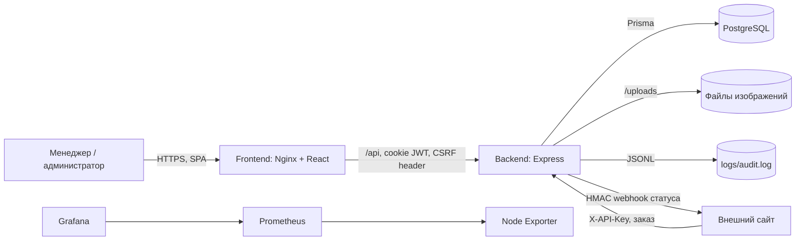
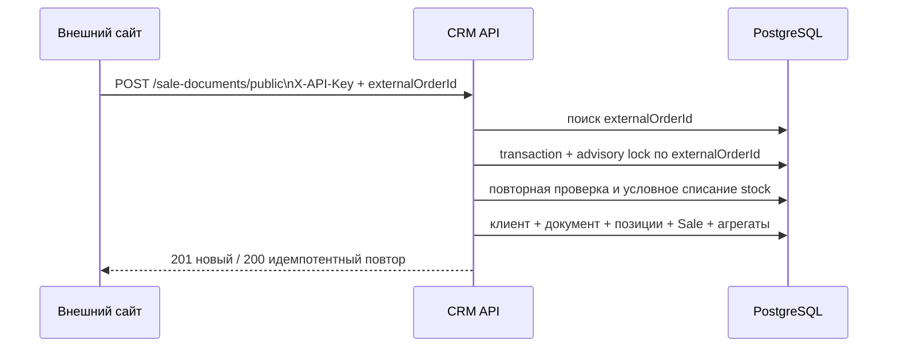

# Архитектура SalesCore CRM

Документ описывает состояние репозитория по фактически подключённому коду на 19 августа 2026 года. README используется только как вспомогательный источник: если он расходится с исходниками и конфигурацией, ниже отражено поведение исходников.

## 1. Назначение и границы системы

Проект — CRM для товарного учёта и продаж тюнинг-ателье. В активный контур входят:

- каталог товаров, категории, настраиваемые характеристики, цены, остатки и изображения;
- клиентская база, персональные скидки и агрегаты по заказам;
- оформление, редактирование и удаление заказов/продаж;
- приём заказов от внешнего сайта и обратная отправка статуса заказа;
- отчёты, расходы, выгрузка аналитики и административные операции с БД;
- файловый аудит части действий пользователей;
- SPA-интерфейс для ролей `manager` и `admin`.

Система является модульным монолитом: один React SPA обращается к одному Express API, а тот работает с одной PostgreSQL БД и локальным файловым хранилищем.



## 2. Структура репозитория

| Путь | Роль |
| --- | --- |
| `frontend/` | React/Vite SPA, API-адаптеры, страницы и UI-компоненты |
| `backend/src/server.ts` | Единственная активная точка входа HTTP API |
| `backend/src/routes/` | Группировка Express-маршрутов по ресурсу |
| `backend/src/controllers/` | HTTP-обработка и основная бизнес-логика, включая транзакции Prisma |
| `backend/src/domain/` | Независимые правила автомата статусов и идемпотентности внешних заказов |
| `backend/src/services/` | Отправка webhook и файловый аудит |
| `backend/src/middleware/` | JWT/RBAC, API key, rate limit, загрузка и обработка изображений; часть middleware не подключена |
| `backend/prisma/` | Актуальная схема данных, миграции и seed-скрипты |
| `backend/tests/` | Модульные тесты доменных правил и webhook-клиента |
| `docker-compose.yml` | Описание БД, приложений и стека мониторинга |
| `prometheus/` | Конфигурация целей Prometheus |
| `.github/workflows/deploy.yml` | Деплой ветки `main` на VPS через SCP/SSH |
| `scripts/backup.sh` | Резервное копирование PostgreSQL volume и `.env` |

Корневой `package.json` только оркестрирует локальный запуск frontend/backend и команды Prisma. Это не workspace: у корня, frontend и backend отдельные `package-lock.json`.

## 3. Компоненты времени выполнения

### 3.1 Frontend

Frontend — клиентское SPA на React 19, TypeScript и Vite 8. `src/main.tsx` монтирует `App` в `React.StrictMode`. `App.tsx` устанавливает глобальные провайдеры темы и авторизации, браузерный роутер и уведомления `react-hot-toast`.

Маршрутизация построена на `react-router-dom`. Единственный открытый экран — `/login`; остальные страницы вложены в `PrivateRoute` и общий `Layout`:

- `/dashboard` — сводка, последние заказы и низкие остатки;
- `/products`, `/products/:id` — каталог и карточка товара;
- `/categories` — категории и их динамические поля;
- `/clients`, `/clients/:id` — клиенты, скидка и история заказов;
- `/sales`, `/sales/new`, `/sales/:id` — список, создание и карточка заказа;
- `/reports` — аналитика, диаграммы и экспорт XLSX на клиенте;
- `/settings` — dump, restore и очистка БД; элементы доступны администратору;
- `/audit` — просмотр и CSV-экспорт аудита, очистка администратором.

`Layout` скрывает `/settings` и `/audit` от менеджера, но отдельного role guard на уровне React Router нет. При прямом переходе страница откроется после обычной проверки авторизации; критичные операции должны и в основном действительно проверяют роль на backend.

Страницы сами загружают данные через модули `src/api/*.ts` и держат серверное/UI-состояние в локальном `useState`. Отдельного глобального state manager или cache/query-библиотеки нет. Общими состояниями являются только:

- `AuthContext`: текущий пользователь, начальная проверка `/auth/me`, login/logout;
- `ThemeContext`: `light`/`dark`, сохранённые в `localStorage`;
- URL-параметры и query string для навигации и части фильтров.

`src/api/client.ts` создаёт единый Axios client с `baseURL = VITE_API_URL || '/api'` и `withCredentials: true`. Для изменяющих методов interceptor лениво получает `/csrf-token` и добавляет `X-CSRF-Token`. Токен хранится только в памяти вкладки. Общего response interceptor нет: обработка ошибок распределена по контексту, страницам и компонентам.

Компоненты организованы в три группы:

- `components/ui/` — базовые элементы, модальные окна, выбор статуса и крупные предметные компоненты корзины/печати;
- `components/layout/` и `PrivateRoute.tsx` — каркас и защита маршрутов;
- `Product*` и `components/modals/` — формы товара и редактирование заказа.

Печать чека/счёта реализована на клиенте компонентом `PrintDocument`. XLSX-выгрузка отчётов также выполняется в браузере. Recharts используется для графиков.

### 3.2 Backend

Backend — Express 4 приложение на TypeScript, собираемое `tsc` в CommonJS (`dist/`) и запускаемое `node dist/server.js`. `server.ts`:

1. загружает `.env`;
2. в production проверяет наличие `SITE_WEBHOOK_URL` и `WEBHOOK_SECRET`;
3. настраивает CORS для фиксированного набора origin;
4. подключает JSON/urlencoded parsers и `cookie-parser`;
5. публикует каталог `/uploads` как статику;
6. применяет собственную CSRF-проверку;
7. монтирует группы API;
8. публикует `/api/health` и слушает `0.0.0.0:PORT` (по умолчанию `5000`).

Основная вертикаль запроса:

```text
HTTP -> server middleware -> resource router -> auth/RBAC/resource middleware
     -> controller -> Prisma / service / filesystem -> JSON response
```

Контроллеры создают собственные экземпляры `PrismaClient`; единого repository/data-access слоя и единого контейнера зависимостей нет. Основная бизнес-логика находится непосредственно в контроллерах. Исключения — чистые доменные функции статусов/идемпотентности и два сервиса.

### 3.3 API-модули

Все активные маршруты имеют префикс `/api`.

| Префикс | Доступ | Ответственность |
| --- | --- | --- |
| `/auth` | login открыт; `me` требует JWT | Вход, выход, текущий пользователь, дополнительная выдача CSRF-токена |
| `/products` | JWT; изменения — `manager`/`admin` | CRUD, низкие остатки, история цены, до 5 изображений товара |
| `/categories` | JWT; изменения — `manager`/`admin` | Категории и определения динамических полей |
| `/clients` | JWT; изменения — `manager`/`admin` | CRUD, поиск, статистика, персональная скидка |
| `/sale-documents` | JWT, кроме двух internal endpoint | Заказы, позиции, оплата, статусы, редактирование, удаление |
| `/reports` | JWT; destructive/dump/restore — `admin` | Сводки, прибыль, расходы, статистика и обслуживание данных |
| `/audit` | JWT; очистка — `admin` | Фильтрация, статистика, CSV, ручная запись и очистка аудита |
| `/public` | без JWT, rate limit | Read-only каталог и категории для внешнего потребителя |
| `/health` | открытый | Проверка процесса API; БД не проверяется |

Internal endpoints интеграции с сайтом:

- `POST /api/sale-documents/public` — создать внешний заказ;
- `PUT /api/sale-documents/internal/:id/full` — полностью обновить заказ внешним сервисом.

Оба требуют `X-API-Key`, проверяемый constant-time сравнением, и ограничены `orderLimiter` (30 запросов в минуту на IP). Несмотря на имя первого маршрута, это не анонимный публичный endpoint. При этом только `POST .../public` исключён из inline CSRF-проверки: `PUT .../internal/:id/full` в production дополнительно потребует совпадающие CSRF cookie/header. Это фактическое ограничение текущей интеграции.

## 4. Данные и владение состоянием

PostgreSQL — источник истины для бизнес-данных. Prisma schema содержит 13 моделей:

| Область | Модели и назначение |
| --- | --- |
| Доступ | `User` — email, bcrypt-хэш пароля, имя и строковая роль |
| Каталог | `Product`, `Category`, `ProductCategory` — товар и many-to-many категории |
| Характеристики | `CategoryField`, `ProductCharacteristic` — схема полей категории и значение товара; уникальность по `(productId, fieldId)` |
| Продажи | `SaleDocument`, `SaleDocumentItem`, `Sale` — документ заказа, снимки его строк и денормализованные показатели продаж |
| Клиенты | `Client` — профиль, автомобильные данные, скидка и счётчики `totalOrders`/`totalSpent` |
| Цены и медиа | `PriceHistory`, `ProductImage` — аудит изменения розничной цены и метаданные файлов |
| Расходы | `Expense` — отдельные операционные расходы для отчётов |

Ключевые связи:

- `Product` связан с категориями через составной ключ `ProductCategory`;
- значения характеристик ссылаются одновременно на товар и `CategoryField`;
- `SaleDocument` может ссылаться на `Client` и создавшего `User`;
- `SaleDocumentItem` хранит ссылку на товар и снимок названия, артикула, цены и себестоимости на момент заказа;
- `Sale` хранит вычисленные выручку, себестоимость и прибыль по строке и при обычном удалении документа остаётся с `documentId = null` только на уровне декларативной FK; контроллер удаления документа удаляет документ транзакционно, а связанное фактическое поведение определяется Prisma cascade/set-null;
- удаление товара каскадно затрагивает его связи, характеристики, строки документов, продажи, изображения и историю цен согласно Prisma schema;
- `externalOrderId` и `documentNumber` уникальны; `statusVersion` поддерживает версионирование статуса внешнего заказа.

`Float` используется для денежных сумм и цен; отдельного decimal/value-object слоя нет. `costBreakdown` товара хранится как JSON. Статусы и роли хранятся строками, а допустимые переходы статусов проверяются в TypeScript.

Файлы не находятся в PostgreSQL:

- обработанные WebP-изображения записываются в `backend/uploads/products`, а в `ProductImage` хранятся URL и метаданные;
- аудит хранится в `backend/logs/audit.log` в формате JSON Lines и загружается в память процесса (максимум 10 000 записей).

## 5. Ключевые бизнес-потоки

### 5.1 Заказ, создаваемый сотрудником

1. `NewOrder`/`ShoppingCartModal` загружает товары, категории и при необходимости клиента.
2. Frontend отправляет позиции, цены, скидку, клиента и способ оплаты в `POST /sale-documents`.
3. Backend проверяет существование товаров и доступный остаток, применяет скидку клиента и формирует уникальный номер документа.
4. В одной Prisma-транзакции создаются `SaleDocument`, снимки `SaleDocumentItem`, денормализованные строки `Sale`, уменьшаются остатки и обновляются агрегаты клиента.
5. Карточка заказа позволяет менять комментарий, тип документа, оплату, состав заказа и статус; печатная форма генерируется браузером.

При полном редактировании заказа старые количества сначала возвращаются на склад, строки документа и `Sale` пересоздаются, затем новые количества списываются и корректируется `Client.totalSpent`. При удалении заказа позиции возвращаются на склад, а агрегаты клиента уменьшаются.

### 5.2 Заказ с внешнего сайта



CRM не доверяет цене из внешнего payload: итог считается по текущей `Product.retail_price`. Идемпотентность построена на обязательном `externalOrderId` и SHA-256 хэше нормализованного смыслового payload. PostgreSQL advisory lock сериализует одинаковый ID между экземплярами API; одинаковый повтор возвращает существующий заказ, а другой payload с тем же ID получает `409`. Остаток уменьшается условным `updateMany(stock >= quantity)`, поэтому параллельные заказы не должны увести его ниже нуля.

Внешний заказ создаётся как оплаченный (`paid`), с `source = website` и начальным статусом `confirmed`.

### 5.3 Статусы и синхронизация с сайтом

`domain/orderStateMachine.ts` задаёт конечный автомат заказа:

```text
confirmed -> assembling -> shipped
     |            |
     +----------> shipped
     |            |
     +----------> cancelled
```

`shipped` и `cancelled` терминальны. Повтор текущего статуса разрешён. Для оплаты допустимы `unpaid`, `pending`, `paid`, `failed`, `refunded`, также с явными разрешёнными переходами.

Обновление статуса использует optimistic compare-and-set по старому значению и увеличивает `statusVersion`. Для заказов `source = website` API синхронно отправляет на `SITE_WEBHOOK_URL` HMAC-SHA256-подписанный payload. Есть до пяти попыток по умолчанию с exponential backoff; retry выполняется для сетевых ошибок, `404`, `409`, `429` и `5xx`. Если доставка исчерпана, статус уже сохранён в CRM, а клиент получает `502` и может повторно сохранить тот же статус для ручного retry.

## 6. Аутентификация и защита

- Login сверяет bcrypt-хэш и выдаёт JWT на 24 часа в HttpOnly cookie `token`; backend также принимает Bearer token.
- Роли строковые: `managerAccess` допускает `manager` и `admin`, `adminMiddleware` — только `admin`.
- Frontend скрывает административные действия в настройках и аудите, но реальная граница доступа обеспечивается backend middleware.
- CORS включает credentials и разрешает только заданные production/local origin.
- Для изменяющих запросов в production применяется double-submit CSRF: читаемый JS cookie `csrf-token` должен совпасть с заголовком. Реализация в `server.ts` освобождает от проверки public paths, методы `GET`, `HEAD`, `OPTIONS` и также `DELETE`; в development CSRF полностью пропускается.
- Login ограничен 10 неуспешными запросами за 15 минут; public catalog ограничивается дважды двумя лимитерами по 500 запросов/минуту; создание/внутреннее обновление внешнего заказа — 30/минуту.
- Загружаются JPEG/PNG/GIF/WebP до 5 МБ, после чего Sharp преобразует изображение в WebP. Backend отдаёт uploads как статику.

Зависимости `helmet` и `compression` установлены, но в `server.ts` не подключены. Middleware из `csrf.middleware.ts`, `validation.middleware.ts`, `audit.middleware.ts`, а также `globalLimiter`/`apiLimiter` существуют, но активным сервером не используются. Поэтому их наличие не следует считать действующей защитой или валидацией.

## 7. Сборка, конфигурация и развёртывание

### Локально

Корневая команда `npm run dev` рассчитана на параллельный запуск backend и frontend, однако в `backend/package.json` нет скрипта `dev`; есть только `build`, `test`, `start` и `migrate`. Vite не содержит dev proxy, поэтому локальному frontend нужен корректный `VITE_API_URL` либо отдельный reverse proxy.

Для БД используются Prisma migrations. Seed-файлы присутствуют, но отдельного `seed` script/Prisma seed declaration в показанном `backend/package.json` нет. Скрипты `migrate-data.ts`, `clean-duplicates.ts` и `create-indexes.js` предназначены для разовых операций, а не вызываются сервером автоматически.

### Docker Compose

Заявленная схема Compose:

- `db`: PostgreSQL 15 с persistent volume и healthcheck;
- `backend`: порт 5000, volume исходников и отдельный persistent volume uploads;
- `frontend`: multi-stage Vite build, Nginx на порту контейнера 80/хоста 8080; `/api` проксируется на backend;
- `prometheus`, `grafana`, `node-exporter`: мониторинг в общей bridge-сети.

Критически важно: в текущем репозитории отсутствует `backend/Dockerfile`, хотя `docker-compose.yml` содержит `build: ./backend`. Поэтому полный `docker compose build/up` из этого состояния не воспроизводим без внешнего/утраченного файла. Frontend Dockerfile существует и корректно собирает статику, но скопированный `frontend/nginx.conf` не включён в образ (`Dockerfile` его не копирует), значит реально контейнер использует стандартную конфигурацию Nginx без описанного reverse proxy и SPA fallback.

Workflow `.github/workflows/deploy.yml` при push в `main` копирует репозиторий на `/var/www/crm-tunning`, затем выполняет `docker-compose down`, prune, build и up. Создаваемый workflow файл `backend/.env` не подставляет все обязательные для Compose переменные верхнего уровня (`POSTGRES_PASSWORD`, `INTERNAL_API_KEY`, `SITE_WEBHOOK_URL`, `WEBHOOK_SECRET`, `GRAFANA_PASSWORD`); работоспособность зависит от внешнего `.env`/окружения на сервере.

## 8. Наблюдаемость, аудит и резервное копирование

- Backend пишет диагностические сообщения в stdout/stderr; структурированного application logger нет.
- `/api/health` возвращает состояние процесса, timestamp и environment, но не проверяет PostgreSQL, filesystem или webhook.
- Prometheus собирает собственные метрики и Node Exporter. Конфигурация также ожидает `/metrics` у backend, однако такой endpoint и библиотека метрик в backend отсутствуют; эта цель будет недоступна.
- Grafana включена в Compose, но provisioning dashboards/datasources в репозитории отсутствует.
- AuditService хранит журнал одновременно в памяти и append-only JSONL-файле, предоставляет фильтры, статистику и CSV. Автоматические записи вызываются из отдельных операций с клиентами; общего подключённого audit middleware нет, поэтому это не полный журнал всех мутаций.
- `scripts/backup.sh` делает `pg_dump`, архив PostgreSQL volume и копию production `.env`, затем удаляет файлы старше 10 дней. Скрипт жёстко привязан к путям `/opt/crm-swap38`, имени контейнера/volume и БД. Его запуск по cron в репозитории не настраивается; uploads отдельным volume этим скриптом не архивируются.
- Дополнительно API даёт администратору JSON dump/restore/clear через `/reports`; это прикладной механизм, отличный от PostgreSQL backup.

## 9. Тесты и проверяемые контракты

`backend/tests` использует встроенный `node:test` через `ts-node/register`. Сейчас тестируются:

- разрешённые и запрещённые переходы статусов заказа и оплаты;
- стабильность/конфликтность semantic hash и формат `externalOrderId`;
- чтение webhook-конфигурации во время вызова, HMAC-подпись и retry временного `404`.

Интеграционных тестов Express API/Prisma, frontend-тестов и end-to-end тестов в репозитории нет. `backend/jest.config.js` присутствует, но `npm test` запускает не Jest. CI workflow выполняет только деплой и не содержит build, lint или test gate.

## 10. Активные и неактивные элементы

Чтобы не принять наличие файла за рабочую часть системы:

- `backend/src/routes/sales.routes.ts` и `controllers/sales.controller.ts` реализуют отдельный CRUD одиночных продаж, но `server.ts` не монтирует этот router. Активный UI работает через `sale-documents`;
- `auth.controller.register` существует, но `/api/auth/register` не объявлен;
- `Dashboard_old.tsx` не импортируется в `App.tsx`;
- `fixSequences.ts`/`initDatabase()` не вызываются при старте;
- `cors-config.js`, `ecosystem.config.js` и Jest config не участвуют в основном Docker/`npm start` пути;
- генерация receipt/invoice на backend не реализована: одноимённые frontend API methods указывают на отсутствующие GET endpoints, а фактическая печать выполняется `PrintDocument` в браузере;
- README описывает некоторые отсутствующие возможности и файлы (задачи, email, Telegram alerts, restore/doctor scripts, backend Dockerfile) и версии, не совпадающие с package manifests; они не входят в эту архитектуру.

## 11. Правила расширения в рамках текущей архитектуры

При добавлении возможности существующая структура предполагает следующий путь:

1. модель/ограничение — `backend/prisma/schema.prisma` и новая migration;
2. чистое межоперационное правило — `backend/src/domain/` с модульным тестом;
3. HTTP-операция — controller и route в соответствующей ресурсной группе;
4. обязательная явная установка JWT/RBAC/rate-limit middleware на route или router;
5. frontend-контракт — функция в `frontend/src/api/`, типы и вызывающая страница/компонент;
6. для новой страницы — маршрут в `App.tsx` и пункт навигации в `Layout`;
7. для внешней интеграции — идемпотентность, подпись/ключ, timeout и наблюдаемое поведение при частичном отказе.

Из-за денормализации заказа одна бизнес-операция часто должна согласованно изменять `SaleDocument`, `SaleDocumentItem`, `Sale`, `Product.stock` и агрегаты `Client`; такие изменения должны оставаться в одной БД-транзакции. Файловые операции (изображения и аудит) транзакцией PostgreSQL не покрываются и требуют отдельного учёта частичных сбоев.
