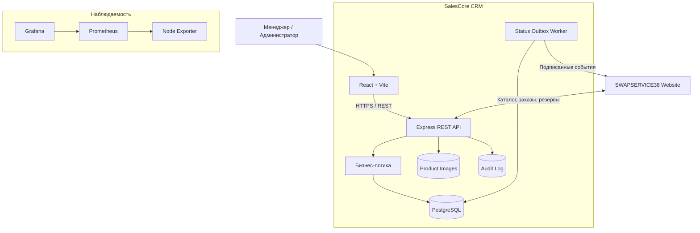
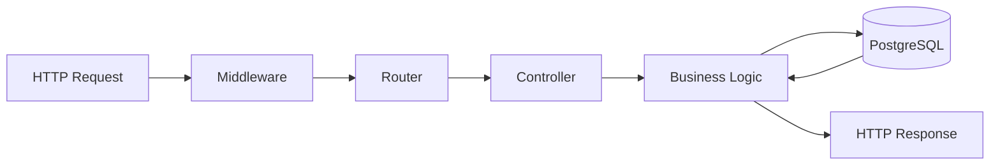
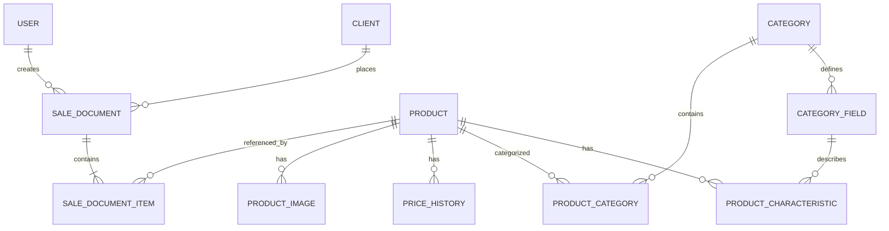
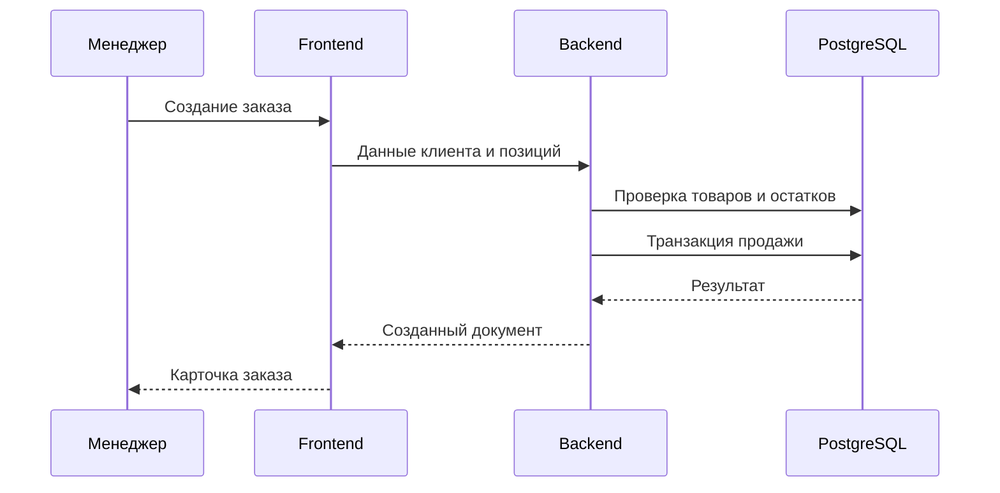
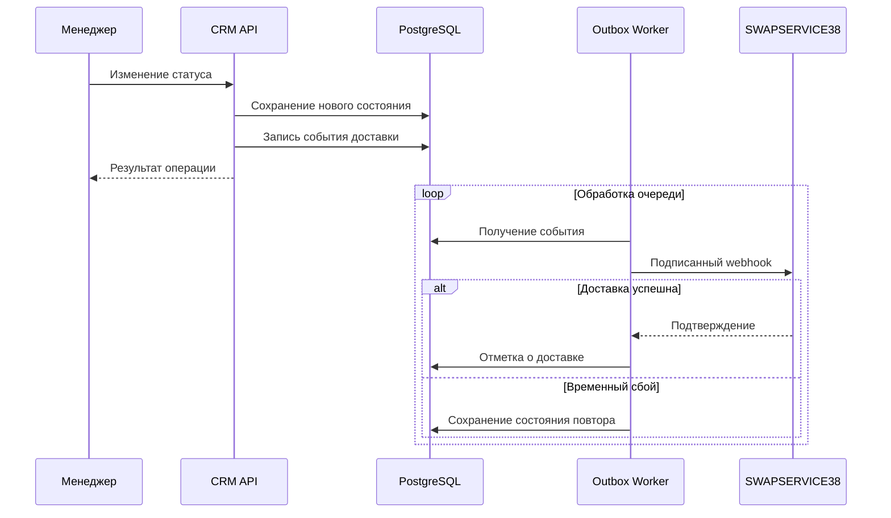

# Архитектура SalesCore CRM

> **SalesCore CRM** — внутренняя информационная система управления продажами, складом, клиентами и аналитикой автомобильного бизнеса SWAPSERVICE38.
>
> Документ описывает архитектуру проекта на основе исходной технической документации от 19.08.2026, актуальных конфигураций и подтверждённых механизмов интеграции. Для деталей, изменённых после первоначального аудита, приоритет имеет текущий исходный код.

---

## 1. Назначение системы

SalesCore CRM разработана для автоматизации внутренних процессов автомобильного сервиса и производства компонентов для тюнинга.

Основные функциональные области:

- Управление товарным каталогом.
- Складской учёт и контроль остатков.
- Категории и характеристики продукции.
- Управление товарными комплектами.
- Расчёт себестоимости и маржинальности.
- Оформление и сопровождение продаж.
- Управление клиентской базой.
- Финансовая аналитика и отчётность.
- Интеграция с интернет-магазином SWAPSERVICE38.
- Администрирование и аудит операций.

CRM является самостоятельным приложением, взаимодействующим с публичной e-commerce платформой через API.

## 2. Архитектурный подход

Проект построен по принципу **модульного монолита**.

Frontend и backend развёртываются как отдельные приложения, однако серверная бизнес-логика сосредоточена в одном Express API.

Основные компоненты:

| Компонент | Назначение |
|---|---|
| React SPA | Пользовательский интерфейс |
| Express API | HTTP-запросы и бизнес-операции |
| Domain | Правила статусов и идемпотентности |
| Prisma ORM | Доступ к PostgreSQL |
| PostgreSQL | Основное хранилище данных |
| File Storage | Изображения товаров |
| Audit | Журналирование действий |
| Outbox Worker | Доставка событий внешнему сайту |
| Docker Compose | Оркестрация контейнеров |
| Prometheus / Grafana | Мониторинг инфраструктуры |

### Общая схема


```mermaid
flowchart TB
    USER["Менеджер / Администратор"]

    subgraph CRM["SalesCore CRM"]
        UI["React + Vite"]
        API["Express REST API"]
        DOMAIN["Бизнес-логика"]
        OUTBOX["Status Outbox Worker"]
        DB[("PostgreSQL")]
        FILES[("Product Images")]
        AUDIT[("Audit Log")]
    end

    SITE["SWAPSERVICE38 Website"]

    subgraph OBS["Наблюдаемость"]
        PROM["Prometheus"]
        GRAF["Grafana"]
        NODE["Node Exporter"]
    end

    USER --> UI
    UI -->|"HTTPS / REST"| API
    API --> DOMAIN
    DOMAIN --> DB
    API --> FILES
    API --> AUDIT
    OUTBOX --> DB

    SITE <-->|"Каталог, заказы, резервы"| API
    OUTBOX -->|"Подписанные события"| SITE

    GRAF --> PROM
    PROM --> NODE
```

Система использует единую основную базу данных PostgreSQL. Отдельный брокер сообщений для доставки статусов не требуется: очередь событий интеграции хранится в БД.

## 3. Технологический стек

### Frontend

- React 19.
- TypeScript.
- Vite 8.
- React Router 7.
- Axios.
- Tailwind CSS.
- Recharts.
- Lucide React.
- React Hot Toast.
- XLSX.

### Backend

- Node.js 20.
- Express 4.
- TypeScript.
- Prisma 5.
- PostgreSQL 15.
- JWT.
- bcryptjs.
- Express Validator.
- Multer.
- Sharp.
- Helmet и другие HTTP middleware.

### Infrastructure

- Docker.
- Docker Compose.
- nginx.
- GitHub Actions.
- Prometheus.
- Grafana.
- Node Exporter.
- Linux VPS.

## 4. Организация исходного кода

### Backend

```text
backend/
├── prisma/
│   ├── schema.prisma
│   └── migrations/
│
├── src/
│   ├── server.ts
│   ├── routes/
│   ├── controllers/
│   ├── domain/
│   ├── services/
│   ├── middleware/
│   └── config/
│
├── tests/
├── scripts/
├── uploads/
└── package.json
```

Основные обязанности:

**Routes**

Объявление HTTP-маршрутов, подключение авторизации и необходимых middleware.

**Controllers**

Обработка запросов, проверка входных данных, вызов бизнес-операций и формирование ответов.

**Domain**

Независимые правила предметной области, включая переходы состояний заказа и проверку идемпотентности.

**Services**

Взаимодействие с внешними системами и вспомогательные операции, в том числе доставка событий и аудит.

**Prisma**

Описание структуры данных, связей и ограничений PostgreSQL.

### Frontend

```text
frontend/
└── src/
    ├── main.tsx
    ├── App.tsx
    ├── api/
    ├── components/
    ├── contexts/
    └── pages/
```

Frontend организован вокруг страниц и компонентов. API-вызовы вынесены в отдельные клиентские модули.

## 5. Frontend

SalesCore использует SPA-архитектуру.

Приложение загружается в браузере, после чего навигация выполняется средствами React Router.

### Основные экраны

| Раздел | Назначение |
|---|---|
| Dashboard | Основные показатели бизнеса |
| Products | Каталог и склад |
| Product Details | Карточка товара |
| Categories | Категории и характеристики |
| Clients | Клиентская база |
| Sales | Заказы и продажи |
| Reports | Аналитика |
| Settings | Административные операции |
| Audit | Просмотр журнала действий |

В актуальном интерфейсе также присутствует раздел товарных комплектов.

### Состояние приложения

Основная часть состояния хранится непосредственно в компонентах и страницах React.

Общие контексты отвечают за авторизацию и оформление интерфейса.

### HTTP-клиент

Для взаимодействия с backend используется Axios.

Базовый адрес API задаётся через `VITE_API_URL` либо относительный путь `/api`.

Запросы выполняются с поддержкой cookie:

```typescript
withCredentials: true
```

Для изменяющих запросов клиент получает CSRF-токен и передаёт его в заголовке `X-CSRF-Token`.

### Визуализация данных

Для построения графиков используется Recharts.

Экспорт аналитических данных в Excel выполняется на стороне frontend через XLSX.

Печатные документы формируются средствами клиентского интерфейса.

## 6. Backend и REST API

Backend представляет собой Express-приложение.

Основная точка входа:

```text
backend/src/server.ts
```

Сервер отвечает за:

1. Загрузку конфигурации.
2. Настройку middleware.
3. Авторизацию.
4. Маршрутизацию запросов.
5. Выполнение бизнес-операций.
6. Работу с PostgreSQL.
7. Интеграцию с внешним сайтом.
8. Обслуживание файлов и журнала аудита.

### Обработка запроса


```mermaid
flowchart LR
    A["HTTP Request"]
    B["Middleware"]
    C["Router"]
    D["Controller"]
    E["Business Logic"]
    F[("PostgreSQL")]
    G["HTTP Response"]

    A --> B --> C --> D --> E --> F
    F --> E --> G
```

### Основные API-модули

Все перечисленные маршруты используют общий префикс `/api`.

| Маршрут | Назначение |
|---|---|
| `/auth` | Аутентификация |
| `/products` | Товары |
| `/categories` | Категории |
| `/clients` | Клиенты |
| `/sale-documents` | Заказы и продажи |
| `/reports` | Аналитика |
| `/audit` | Аудит |
| `/public` | Данные для внешних потребителей |
| `/health` | Проверка состояния HTTP API |

Интеграционные маршруты дополнительно используют внутренние ключи доступа.

Фактический набор endpoint и их контракты определяются актуальными router-файлами.

## 7. Модель данных

PostgreSQL используется как основное хранилище бизнес-данных.

Prisma обеспечивает типизированный доступ к моделям и управление миграциями.

### Основные сущности

| Область | Сущности |
|---|---|
| Доступ | `User` |
| Каталог | `Product`, `Category`, `ProductCategory` |
| Характеристики | `CategoryField`, `ProductCharacteristic` |
| Продажи | `SaleDocument`, `SaleDocumentItem`, `Sale` |
| Клиенты | `Client` |
| Цены | `PriceHistory` |
| Изображения | `ProductImage` |
| Расходы | `Expense` |
| Комплекты | `ProductKit`, `ProductKitItem` |
| Резервирование | `InventoryReservation`, `InventoryReservationItem` |
| Интеграция | `CrmStatusOutboxEvent` |

Первые группы сущностей описаны в исходном архитектурном документе. Комплекты, резервирование и outbox относятся к более поздним возможностям проекта.

### Связи основных сущностей


```mermaid
erDiagram
    USER ||--o{ SALE_DOCUMENT : creates
    CLIENT ||--o{ SALE_DOCUMENT : places
    SALE_DOCUMENT ||--|{ SALE_DOCUMENT_ITEM : contains
    PRODUCT ||--o{ SALE_DOCUMENT_ITEM : referenced_by
    PRODUCT ||--o{ PRODUCT_IMAGE : has
    PRODUCT ||--o{ PRICE_HISTORY : has
    PRODUCT ||--o{ PRODUCT_CATEGORY : categorized
    CATEGORY ||--o{ PRODUCT_CATEGORY : contains
    CATEGORY ||--o{ CATEGORY_FIELD : defines
    PRODUCT ||--o{ PRODUCT_CHARACTERISTIC : has
    CATEGORY_FIELD ||--o{ PRODUCT_CHARACTERISTIC : describes
```

Диаграмма отражает основные логические связи. Точные внешние ключи и правила удаления задаются `schema.prisma`.

### Денормализация

При создании продажи CRM сохраняет не только ссылку на товар, но и снимок коммерческих параметров позиции.

Это необходимо, чтобы последующие изменения каталога не искажали исторические документы и расчёты.

Данные заказа могут затрагивать одновременно:

- `SaleDocument`.
- `SaleDocumentItem`.
- `Sale`.
- `Product`.
- `Client`.

Такие изменения должны выполняться согласованно внутри транзакции PostgreSQL.

## 8. Складской учёт

Складской модуль отвечает за хранение и изменение остатков товаров.

Основные операции:

- Добавление товара.
- Изменение количества.
- Списание при продаже.
- Возврат количества при отмене или редактировании.
- Контроль минимального остатка.
- Получение информации о наличии.
- Резервирование для внешних заказов.

### Параллельные операции

При одновременном оформлении заказов важно исключить некорректное списание остатков.

В исходной реализации внешних заказов использовалось условное обновление записи товара с проверкой доступного количества.

Для новых сценариев резервирования отдельные правила определяются текущей реализацией соответствующих сервисов.

## 9. Товары, категории и комплекты

### Товары

Карточка товара объединяет:

- Название и артикул.
- Розничную цену.
- Себестоимость.
- Складской остаток.
- Категории.
- Характеристики.
- Изображения.
- Историю цен.

### Себестоимость

Для товаров предусмотрена детализация затрат.

Это позволяет учитывать составляющие себестоимости и рассчитывать маржинальность.

### Категории

Категории позволяют группировать ассортимент и задавать дополнительные характеристики продукции.

### Комплекты

Комплект представляет собой объединение нескольких товарных позиций.

Этот механизм предназначен для составных решений, например комплектов установки двигателей и автомобильных компонентов.

Конкретные правила списания и резервирования компонентов комплекта определяются реализацией backend.

## 10. Обработка внутренних продаж

Заказ может создаваться непосредственно сотрудником CRM.

Общий сценарий:


```mermaid
sequenceDiagram
    participant M as Менеджер
    participant UI as Frontend
    participant API as Backend
    participant DB as PostgreSQL

    M->>UI: Создание заказа
    UI->>API: Данные клиента и позиций
    API->>DB: Проверка товаров и остатков
    API->>DB: Транзакция продажи
    DB-->>API: Результат
    API-->>UI: Созданный документ
    UI-->>M: Карточка заказа
```

В рамках бизнес-операции CRM:

1. Проверяет товарные позиции.
2. Рассчитывает суммы и скидки.
3. Формирует документ.
4. Сохраняет позиции продажи.
5. Изменяет складские остатки.
6. Обновляет связанные клиентские показатели.

Редактирование и отмена заказа требуют согласованной корректировки этих данных.

## 11. Интеграция со SWAPSERVICE38

CRM и интернет-магазин представляют собой независимые приложения.

**SWAPSERVICE38 Website** отвечает за публичный каталог, пользовательские аккаунты, оформление заказов и платежи.

**SalesCore CRM** отвечает за внутренние данные каталога, складской учёт и операционную обработку продаж.

Репозиторий интернет-магазина:

https://github.com/Mikhail1708/swapservice38-website

### Обмен данными

Основные направления интеграции:

- Получение каталога и остатков.
- Создание и обработка внешних заказов.
- Резервирование продукции.
- Изменение состояния заказа.
- Синхронизация статусов.

### Авторизация сервисных запросов

Внутренние интеграционные запросы используют API-ключ.

Для событий обратной синхронизации применяется HMAC-подпись.

### Идемпотентность

Для внешних заказов предусмотрена защита от повторного выполнения одной бизнес-операции.

В исходной архитектуре использовались:

- `externalOrderId`.
- Нормализованный хэш запроса.
- PostgreSQL advisory lock.
- Проверка конфликта повторного payload.

Это позволяет отличать допустимый повтор запроса от попытки использовать тот же идентификатор для другой операции.

## 12. Синхронизация статусов и Transactional Outbox

CRM содержит механизм фоновой доставки событий изменения статуса внешнего заказа.

### Принцип работы


```mermaid
sequenceDiagram
    participant M as Менеджер
    participant API as CRM API
    participant DB as PostgreSQL
    participant W as Outbox Worker
    participant S as SWAPSERVICE38

    M->>API: Изменение статуса
    API->>DB: Сохранение нового состояния
    API->>DB: Запись события доставки
    API-->>M: Результат операции

    loop Обработка очереди
        W->>DB: Получение события
        W->>S: Подписанный webhook
        alt Доставка успешна
            S-->>W: Подтверждение
            W->>DB: Отметка о доставке
        else Временный сбой
            W->>DB: Сохранение состояния повтора
        end
    end
```

### Задачи outbox

- Отделение изменения заказа от доступности внешнего сайта.
- Сохранение события до его доставки.
- Повторная обработка временных ошибок.
- Отслеживание состояния синхронизации.

События хранятся в PostgreSQL.

Механизм предполагает, что получатель должен корректно обрабатывать повторную доставку.

### Состояния заказа

Доменные правила определяют допустимые переходы статусов.

Исходная модель предусматривала:

```text
confirmed
    |
    v
assembling
    |
    v
shipped

cancelled
```

Точные переходы, включая отмену, повторные запросы и терминальные состояния, задаются актуальным `orderStateMachine.ts`.

## 13. Авторизация и управление доступом

CRM использует JWT-аутентификацию.

Токен передаётся через HttpOnly cookie. Backend также поддерживал Bearer token в исходной реализации.

### Роли

| Роль | Назначение |
|---|---|
| `manager` | Операционная работа с CRM |
| `admin` | Расширенные административные действия |

Проверки доступа выполняются на серверной стороне.

Скрытие пунктов меню во frontend используется для удобства интерфейса, но не является механизмом защиты API.

### Защитные механизмы

В архитектуре предусмотрены:

- Проверка JWT.
- Разграничение ролей.
- CSRF-защита изменяющих запросов.
- CORS.
- Rate limiting.
- Проверка внутренних API-ключей.
- HMAC-подпись webhook.
- Ограничение загрузки изображений.
- Валидация входных данных.

Фактическое применение middleware определяется подключением в `server.ts` и соответствующих маршрутах. Наличие установленной библиотеки само по себе не означает, что защита активна.

## 14. Работа с изображениями

CRM позволяет прикреплять изображения к товарам.

Обработка включает:

1. Приём файла.
2. Проверку формата и размера.
3. Обработку через Sharp.
4. Сохранение WebP.
5. Запись метаданных в PostgreSQL.

Сами файлы изображений хранятся отдельно от БД.

Это важно учитывать при резервном копировании и переносе системы.

## 15. Аудит действий

CRM предусматривает журналирование отдельных действий сотрудников.

В исходной архитектуре аудит использовал JSON Lines и файловое хранение.

Журнал поддерживал:

- Запись событий.
- Просмотр истории.
- Фильтрацию.
- Статистику.
- Экспорт CSV.
- Административную очистку.

Степень охвата событий зависит от конкретных точек подключения аудита. Его нельзя автоматически считать полным журналом всех изменений в базе данных.

## 16. Аналитика

Аналитический модуль агрегирует данные о продажах и финансовых показателях.

Основные метрики:

- Количество оплаченных заказов.
- Выручка.
- Себестоимость.
- Прибыль.
- Средний чек.
- Маржинальность.
- Популярные товары.
- Покупатели.
- География продаж.

Интерфейс поддерживает фильтрацию по периоду, товарам, клиентам и городам.

Для графиков используется Recharts, для экспорта — XLSX.

Расчёты финансовых показателей должны учитывать состояние оплаты и сохранённые исторические данные продажи.

## 17. Docker и развёртывание

Приложение использует Docker Compose.

### Состав контейнеров

| Сервис | Назначение |
|---|---|
| `db` | PostgreSQL 15 |
| `backend` | Express API |
| `frontend` | React-приложение через nginx |
| `prometheus` | Сбор метрик |
| `grafana` | Панели мониторинга |
| `node-exporter` | Метрики хоста |

### Постоянные данные

Docker volumes используются для хранения:

- PostgreSQL.
- Загруженных изображений.
- Данных Prometheus.
- Данных Grafana.

При пересоздании контейнеров эти данные должны сохраняться.

### Конфигурация

Переменные окружения содержат настройки:

- PostgreSQL.
- JWT.
- Внутреннего API.
- Webhook-интеграции.
- Grafana.

Реальные значения секретов не должны попадать в документацию или публичные примеры.

### CI/CD

В проекте присутствует GitHub Actions workflow для автоматизации развёртывания.

Исторически workflow был привязан к ветке `main`.

После смены основной ветки GitHub на `feature/edit-order` необходимо отдельно проверить триггеры workflow и серверную конфигурацию. Изменение Default branch не переключает автоматически все правила развёртывания.

**Важно:** команды обновления production не приводятся как универсальный способ установки. Они зависят от состояния работающего сервера, volumes и конфигурации интеграций.

## 18. Мониторинг

Для наблюдения за инфраструктурой используются:

**Prometheus**

Сбор метрик из настроенных источников.

**Node Exporter**

Метрики CPU, RAM, файловой системы и других ресурсов сервера.

**Grafana**

Визуализация доступных показателей.

Наличие сервисов мониторинга не гарантирует, что все прикладные метрики backend экспортируются. Состав реально доступных метрик определяется конфигурацией Prometheus и HTTP endpoint приложения.

### Healthcheck

Backend предоставляет:

```text
GET /api/health
```

Проверка доступности HTTP API не эквивалентна полной диагностике PostgreSQL, файлового хранилища и внешних интеграций.

## 19. Резервное копирование и восстановление

Для восстановления CRM важно сохранять несколько категорий данных.

### PostgreSQL

Содержит основные бизнес-сущности, связи и состояния интеграции.

### Изображения

Хранятся отдельно от базы и должны резервироваться с учётом фактического размещения uploads.

### Конфигурация

Содержит параметры подключения и секреты, которые должны храниться защищённо.

### Прикладной экспорт

CRM также предусматривает административный механизм JSON dump/restore.

Он отличается от резервного копирования PostgreSQL и не должен автоматически считаться его полной заменой.

Перед восстановлением необходимо учитывать работу внешней интеграции, резервов и фоновых обработчиков событий.

Подробности приведены в [BACKUP_RESTORE.md](BACKUP_RESTORE.md).

## 20. Тестирование

Backend использует встроенный тестовый механизм Node.js через `node:test` и `ts-node/register`.

Команда:

```bash
cd backend
npm test
```

Сборка:

```bash
npm run build
```

В исходном архитектурном документе подтверждались тесты:

- Переходов состояний заказов.
- Переходов состояний оплаты.
- Идемпотентности внешних запросов.
- Формирования и проверки webhook.
- Повторной доставки при временных ошибках.

Актуальный набор тестов определяется содержимым `backend/tests`.

Frontend предусматривает:

```bash
cd frontend
npm run lint
npm run build
```

Эти команды проверяют разные аспекты проекта и не заменяют полноценное интеграционное и end-to-end тестирование.

## 21. Принципы дальнейшего развития

При расширении SalesCore CRM рекомендуется сохранять следующие правила.

### Целостность данных

Операции, затрагивающие заказ, склад и финансовые показатели, должны выполняться согласованно.

### Идемпотентность

Повторные интеграционные запросы не должны приводить к повторному списанию или созданию дублирующих операций.

### Разделение ответственности

Frontend отвечает за представление, backend — за бизнес-правила и проверку прав.

### Контроль интеграций

Изменение контракта CRM и сайта должно сопровождаться проверкой совместимости обеих систем.

### Безопасность изменений

Изменения схемы данных требуют миграций, а изменения критических бизнес-процессов — тестов.

### Сохранность данных

Развёртывание и обслуживание системы не должны предполагать удаление постоянных volumes или сброс production-базы.

---

## Связанные документы

- [README.md](README.md) — описание проекта и интерфейса.
- [BACKUP_RESTORE.md](BACKUP_RESTORE.md) — резервное копирование и восстановление.
- [SWAPSERVICE38 Website](https://github.com/Mikhail1708/swapservice38-website) — интегрированная e-commerce платформа.

---

**SalesCore CRM**

*Business Operations × Software Engineering*

Разработчик: [Mikhail1708](https://github.com/Mikhail1708)
