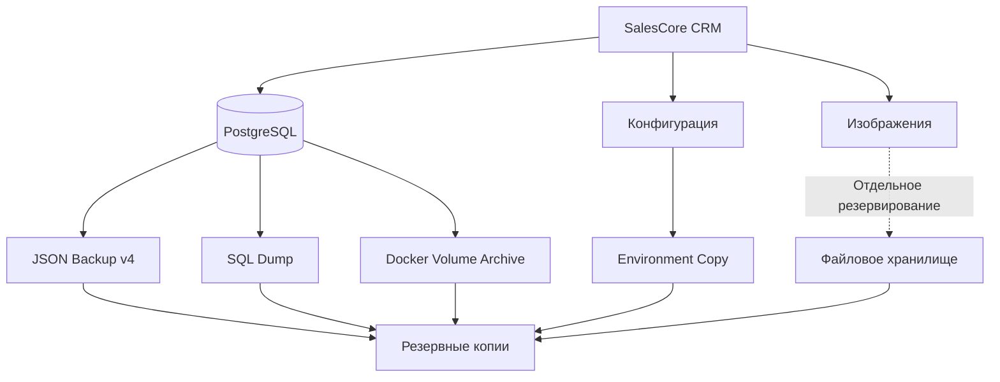
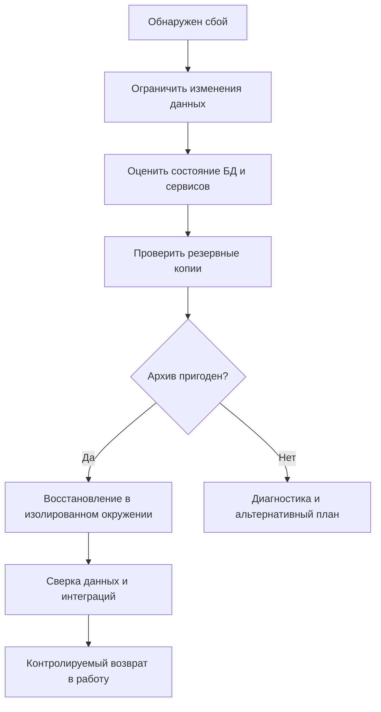

# Резервное копирование и восстановление SalesCore CRM

> **SalesCore CRM — Backup & Disaster Recovery**
>
> Документ описывает существующие механизмы резервного копирования, ограничения форматов, порядок подготовки к восстановлению и требования к сохранности данных.
>
> **Важно:** восстановление production-данных — потенциально разрушительная операция. Не выполняйте её без проверенного архива, согласованного окна обслуживания и отдельного плана восстановления.

---

## 1. Общая информация

SalesCore CRM хранит коммерческие данные автомобильного бизнеса, включая:

- Пользователей и права доступа.
- Каталог товаров и категории.
- Клиентскую базу.
- Документы продаж и позиции заказов.
- Финансовые показатели и расходы.
- Историю цен.
- Изображения продукции.
- Складские остатки и резервирования.
- События синхронизации со SWAPSERVICE38.

Для сохранения этих данных в проекте предусмотрены два механизма:

| Механизм | Назначение |
|---|---|
| JSON Backup v4 | Прикладной экспорт и административное восстановление |
| SQL / Docker Backup | Резервирование PostgreSQL и части серверных данных |

Эти механизмы имеют разные свойства и не являются полностью взаимозаменяемыми.

## 2. Архитектура резервного копирования



Диаграмма показывает существующие механизмы и необходимое отдельное резервирование файлов. Она не означает, что все эти операции уже объединены в одну проверенную автоматическую процедуру.

---

## 3. JSON Backup v4

JSON Backup v4 предназначен для экспорта бизнес-данных CRM.

### Содержимое

Формат включает:

- Пользователей.
- Каталог продукции.
- Категории и характеристики.
- Клиентов.
- Документы продаж.
- Позиции документов.
- Продажи.
- Расходы.
- Историю цен.
- Данные `ProductImage`.
- Складские резервы.
- Позиции резервов.
- Durable status outbox.

### Согласованность

Экспорт выполняется в рамках одного снимка PostgreSQL с уровнем изоляции:

`REPEATABLE READ`

Это позволяет получить согласованное представление данных на момент создания резервной копии.

### Особенности сериализации

| Тип данных | Представление |
|---|---|
| Денежные поля BigInt | Десятичные строки |
| Бинарные данные ProductImage | Base64 |
| Складские резервы | Состояние, срок действия, количество, суммы |
| Outbox | ID, payload, состояние доставки |

Исторические изображения, хранящиеся непосредственно в файловой системе, необходимо копировать отдельно.

## 4. Восстановление JSON v4

Восстановление является **полной заменой данных**, а не объединением с текущей базой.

### Подготовка

Перед восстановлением необходимо:

1. Проверить выбранный архив.
2. Создать свежую резервную копию v4.
3. Согласовать окно технического обслуживания.
4. Остановить приём новых заказов.
5. Остановить внешние обработчики и доставку событий.
6. Убедиться, что известны актуальные состояния заказов и платежей.
7. Подготовить процедуру сверки CRM и сайта после восстановления.

### Механизм восстановления

Восстановление:

- Блокирует затрагиваемые таблицы.
- Удаляет зависимые записи перед родительскими.
- Вставляет данные в порядке внешних ключей.
- Использует одну транзакцию.
- Прерывает транзакцию при нарушении ограничений.
- Перезапускает последовательности транзакционным `ALTER SEQUENCE RESTART`.

Некорректные записи и ошибки внешних ключей не пропускаются автоматически.

### Сохранение доступа

При восстановлении сохраняется текущий административный доступ.

Восстановленные пользовательские сессии получают новые поколения авторизации, что предотвращает некорректное повторное использование старых сессий.

### Складские резервы

Восстанавливаются:

- Статус резерва.
- Время истечения.
- Количество товаров.
- Денежные значения.

Остатки берутся из того же согласованного снимка.

**Повторного списания товара при восстановлении не происходит.**

### Outbox

Сохраняются идентификаторы событий, payload и состояние доставки.

Прерванные операции обработки переводятся в состояние ожидания повторной попытки.

### Внешние операции

Восстановление базы не отменяет действия, уже выполненные вне CRM.

Например:

- Отправленный webhook.
- Проведённый платёж.
- Возврат денежных средств.
- Изменение заказа во внешней системе.

Поэтому после восстановления обязательна сверка состояния CRM со SWAPSERVICE38 и платёжными операциями.

---

## 5. Совместимость со старыми форматами

Поддерживаются ограничения для старых JSON-бэкапов.

### Legacy v3 и конвертированный v1

Эти форматы не содержат:

- Складские резервы.
- Outbox.
- Изображения.
- Историю цен.

Для восстановления старого формата предусмотрена дополнительная проверка.

### Требования API

Необходима политика:

`legacyRuntimePolicy: "require-empty"`

Восстановление отклоняется до удаления данных, если хотя бы одна из отсутствующих в архиве таблиц содержит записи.

Пользовательский интерфейс также требует явного подтверждения восстановления старого формата.

**Нельзя обходить ограничение очисткой рабочей базы.**

Если резервная копия не содержит необходимых данных, их нельзя восстановить автоматически.

Рекомендуемый вариант — использовать полноценный архив v4 либо подготовить и проверить преобразование старого формата в изолированном окружении.

---

## 6. Серверное резервное копирование

В репозитории находится скрипт:

`scripts/backup.sh`

Он предусматривает три операции:

1. Создание SQL-дампа PostgreSQL.
2. Архивирование Docker volume базы данных.
3. Копирование файла окружения `.env`.

### Параметры существующего скрипта

| Параметр | Значение |
|---|---|
| Каталог | `/opt/crm-swap38/backups` |
| Контейнер БД | `crm-db` |
| База данных | `crm_db` |
| Пользователь | `postgres` |
| Срок хранения | 10 дней |
| Формат SQL | `.sql` |
| Формат volume | `.tar.gz` |
| Лог | `backup.log` |

### Имена файлов

```text
crm_backup_YYYYMMDD_HHMMSS.sql
crm_backup_YYYYMMDD_HHMMSS_volumes.tar.gz
crm_backup_YYYYMMDD_HHMMSS.env
```

Скрипт удаляет подходящие файлы старше установленного срока хранения.

### Важные ограничения

Существующий `backup.sh` необходимо рассматривать как базовый механизм резервирования, а не как подтверждённую полноценную систему восстановления.

В частности:

- Не проверяется успешность всех операций перед записью сообщения о создании архива.
- Не проверяется целостность полученного SQL-дампа.
- Не выполняется автоматическое тестовое восстановление.
- Копия `.env` создаётся без встроенного шифрования.
- Отдельное резервирование каталога uploads в показанном скрипте отсутствует.
- Архив Docker volume, созданный при работающем PostgreSQL, нельзя автоматически считать согласованной физической копией БД.

SQL-дамп и архив volume также не гарантируют одинаковую точку времени создания.

**Сохранение копии `.env` требует строгих прав доступа и защищённого хранения**, поскольку в ней могут находиться действующие секреты.

---

## 7. Хранение резервных копий

Рекомендуется разделять резервные копии по назначению.

| Тип | Содержимое |
|---|---|
| Database | SQL-дампы и прикладные JSON-экспорты |
| Media | Изображения и загруженные файлы |
| Configuration | Защищённые копии конфигурации |
| Recovery | Проверенные наборы для восстановления |

Для повышения надёжности рекомендуется:

- Хранить копии отдельно от рабочего сервера.
- Ограничивать доступ к архивам.
- Шифровать конфиденциальные данные.
- Проверять целостность файлов.
- Контролировать свободное место.
- Периодически выполнять тестовое восстановление.
- Настроить уведомления об ошибках резервирования.

Это рекомендации по развитию системы, а не утверждение, что все перечисленные меры уже реализованы.

---

## 8. Восстановление PostgreSQL

Восстановление SQL-дампа и физическое восстановление Docker volume — разные процедуры.

### SQL-дамп

Содержит логическое представление данных PostgreSQL.

Для восстановления необходимо заранее проверить:

- Версию PostgreSQL.
- Наличие нужной базы.
- Права пользователя.
- Совместимость схемы.
- Отсутствие активных бизнес-операций.
- Состояние интеграций и фоновых процессов.

### Архив Docker volume

Содержит файлы каталога данных PostgreSQL.

Его нельзя распаковывать поверх работающей базы.

Для физического восстановления необходим согласованный архив, совместимое окружение и отдельно проверенная процедура.

**Текущий скрипт не подтверждает пригодность такого архива для восстановления работающей БД.**

Поэтому универсальные команды перезаписи PostgreSQL здесь намеренно не приводятся.

---

## 9. Восстановление после сбоя

Общий план disaster recovery:



### Перед восстановлением

Необходимо определить:

- Причину сбоя.
- Последний согласованный архив.
- Время создания копии.
- Какие операции могли произойти после резервирования.
- Есть ли неподтверждённые платежи.
- Существуют ли активные резервы.
- Есть ли недоставленные события outbox.

### После восстановления

Необходимо проверить:

- Доступность CRM.
- Целостность каталога.
- Остатки товаров.
- Клиентские данные.
- Заказы и продажи.
- Состояние резервов.
- Банковские счета и оплаты.
- Очередь событий.
- Согласованность статусов с сайтом.
- Доступность изображений.

Возобновлять обработку новых заказов следует только после проверки критических бизнес-состояний.

---

## 10. Синхронизация со SWAPSERVICE38

CRM доставляет события изменения заказов на внешний endpoint:

`https://swap38.ru/api/webhooks/crm/order-status`

Конфигурация использует:

- `SITE_WEBHOOK_URL`.
- `WEBHOOK_SECRET`.

Подпись сообщений:

`HMAC-SHA256`

Заголовок:

`X-Webhook-Signature`

Повторные попытки доставки контролируются долговременной очередью PostgreSQL outbox.

### Проверка production-конфигурации

При запуске backend проверяет допустимость URL и секретов интеграции.

Production-конфигурация отклоняет:

- HTTP вместо HTTPS.
- Локальные адреса.
- Неверный путь endpoint.
- Отсутствующие секреты.
- Значения-заглушки.

### После восстановления

Необходимо учитывать, что сайт мог уже получить часть событий до сбоя.

Повторная доставка должна обрабатываться идемпотентно.

Нельзя считать восстановление завершённым только потому, что база данных успешно загрузилась.

---

## 11. Автоматизация

В репозитории имеется скрипт резервного копирования, однако его наличие само по себе не подтверждает, что на production-сервере настроен cron и что резервирование успешно выполняется по расписанию.

Для подтверждения автоматизации необходимо отдельно проверить:

- Реальное расписание.
- Журналы последних запусков.
- Наличие и размеры архивов.
- Результаты проверки целостности.
- Политику хранения.
- Доступность внешней копии.
- Результаты тестового восстановления.

До проведения такой проверки статус автоматического резервирования следует считать неподтверждённым.

---

## 12. Требования к безопасности

Резервные копии CRM могут содержать:

- Персональные данные клиентов.
- Данные сотрудников.
- Историю покупок.
- Финансовую информацию.
- Хэши паролей.
- Конфигурационные секреты.
- Служебные идентификаторы интеграций.

Поэтому запрещается:

- Публиковать реальные архивы в GitHub.
- Добавлять `.env` в репозиторий.
- Отправлять резервные копии в публичные чаты.
- Хранить секреты без ограничения доступа.
- Использовать production-данные в тестовом окружении без необходимых мер защиты.

---

## 13. Текущие ограничения и развитие

На основании представленных файлов подтверждены следующие задачи для дальнейшего улучшения:

| Область | Текущее состояние |
|---|---|
| JSON Backup v4 | Документирован |
| Legacy restore guard | Документирован |
| SQL backup | Реализован скриптом |
| Docker volume backup | Реализован скриптом |
| Ротация | 10 дней |
| Отдельный backup uploads | Не подтверждён |
| Шифрование архивов | Не подтверждено |
| Проверка SQL-дампа | В скрипте отсутствует |
| Проверка кода возврата всех операций | В скрипте отсутствует |
| Автоматическое тестовое восстановление | Не подтверждено |
| Cron | Не подтверждён |
| Скрипт `crm-restore` | В предоставленной папке отсутствует |
| Скрипт `crm-doctor` | В предоставленной папке отсутствует |

Приоритет дальнейшего развития — обеспечить проверяемость резервных копий, безопасное хранение и воспроизводимое восстановление в изолированном окружении.

---

## Связанные документы

- [README.md](README.md) — описание проекта.
- [ARCHITECTURE.md](ARCHITECTURE.md) — архитектура CRM.
- [SWAPSERVICE38](https://github.com/Mikhail1708/swapservice38-website) — связанная e-commerce платформа.

---

**SalesCore CRM**

*Data Integrity × Business Continuity × Disaster Recovery*

Разработчик: [Mikhail1708](https://github.com/Mikhail1708)
