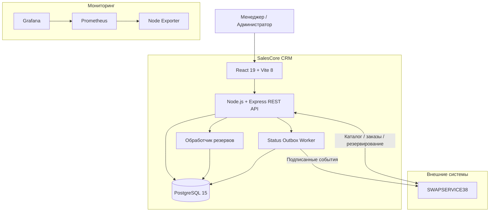

# SalesCore CRM

### Full-stack CRM-платформа для управления продажами, складом и автомобильным бизнесом

[](https://www.typescriptlang.org/)
[](https://react.dev/)
[](https://nodejs.org/)
[](https://www.postgresql.org/)
[](https://www.docker.com/)

**[SWAPSERVICE38](https://swap38.ru)** · **[Архитектура CRM](ARCHITECTURE.md)** · **[Резервное копирование](BACKUP_RESTORE.md)**

---

**SalesCore CRM** — специализированная система управления продажами, товарным учётом и клиентской базой, разработанная для действующего автомобильного сервиса и тюнинг-ателье **SWAPSERVICE38**.

Проект объединяет складской учёт, каталог продукции, работу с заказами, клиентскую базу, аналитику, управление товарными комплектами и интеграцию с отдельной e-commerce платформой.

Система разработана с нуля одним разработчиком: от проектирования моделей данных и реализации пользовательского интерфейса до серверной логики, интеграций и инфраструктуры.

> **Тип проекта:** коммерческая CRM-система  
> **Назначение:** внутренние операции автомобильного бизнеса  
> **Архитектура:** React SPA + Express REST API + PostgreSQL  
> **Связанная платформа:** [SWAPSERVICE38](https://github.com/Mikhail1708/swapservice38-website)

## О проекте

SalesCore CRM создавалась как внутренняя система для автоматизации процессов автомобильного сервиса.

Вместо использования универсальной CRM реализована собственная платформа с учётом специфики бизнеса: производства автомобильных комплектующих, складских остатков, комплектации товаров, продаж и заказов с внешнего сайта.

### Основные задачи

- Централизованный учёт товаров и остатков.
- Управление продажами и заказами.
- Ведение клиентской базы.
- Контроль закупочной и розничной стоимости.
- Анализ выручки, расходов и прибыли.
- Обработка заказов интернет-магазина.
- Согласованная работа CRM и внешней платформы.
- Контроль действий пользователей и административных операций.

## Функциональные возможности

### 01. Каталог и складской учёт

- Создание и редактирование товаров.
- Управление артикулами, ценами и себестоимостью.
- Контроль текущих и минимальных остатков.
- Категории и настраиваемые характеристики.
- Работа с изображениями товаров.
- История изменения цен.
- Публикация товаров для внешнего каталога.

### 02. Товарные комплекты

CRM поддерживает комплекты, состоящие из нескольких товарных позиций.

Для комплекта хранятся состав, количество компонентов и порядок отображения. Компоненты связаны с основным каталогом продукции.

Это позволяет описывать сложные товарные решения, в том числе наборы автомобильных компонентов.

### 03. Заказы и продажи

- Создание заказов сотрудниками.
- Формирование документов продажи.
- Добавление товаров и применение скидок.
- Учёт оплаты и состояния заказа.
- Редактирование и отмена заказов.
- Контроль остатков при выполнении операций.
- Печатные документы.
- История продаж и показатели прибыли.

Операции с заказами связаны с изменением складских остатков и финансовых показателей.

### 04. Клиентская база

- Контактные данные клиентов.
- Информация об автомобилях.
- История заказов.
- Индивидуальные скидки.
- Учёт общей суммы покупок.
- Поиск и редактирование клиентских данных.

### 05. Аналитика

- Сводные показатели продаж.
- Анализ выручки и прибыли.
- Учёт расходов.
- Графики и отчёты.
- Экспорт данных в XLSX.
- Отображение товаров с низкими остатками.

Для визуализации аналитики используется **Recharts**.

### 06. Интеграция с интернет-магазином

SalesCore CRM взаимодействует с отдельной e-commerce платформой SWAPSERVICE38.

CRM участвует в обработке каталога, складских остатков, резервирования товаров, заказов и синхронизации их статусов.

Интеграция предусматривает:

- REST API.
- Внутренние запросы с API-ключом.
- Проверку повторных операций.
- Резервирование товаров.
- Учёт идентификаторов внешних заказов.
- Обработку подтверждений и отмен.
- Подписанные webhook-сообщения.
- Асинхронную доставку событий через outbox.

### 07. Администрирование и аудит

- Роли `manager` и `admin`.
- Разграничение доступа к операциям.
- Просмотр журнала аудита.
- Экспорт записей аудита.
- Административные операции с данными.
- Механизмы резервного копирования и восстановления.

## Технологический стек

| Компонент | Технологии |
|---|---|
| Frontend | React 19, TypeScript |
| Сборка | Vite 8 |
| Стилизация | Tailwind CSS |
| Маршрутизация | React Router 7 |
| HTTP-клиент | Axios |
| UI | Lucide React, React Hot Toast |
| Аналитика | Recharts |
| Экспорт | XLSX |
| Backend | Node.js, Express 4, TypeScript |
| ORM | Prisma 5 |
| База данных | PostgreSQL 15 |
| Авторизация | JWT, cookies |
| Изображения | Multer, Sharp |
| Контейнеризация | Docker, Docker Compose |
| Веб-сервер | nginx |
| Мониторинг | Prometheus, Grafana, Node Exporter |
| CI/CD | GitHub Actions |
| Интеграции | REST API, webhooks |

## Архитектура

CRM построена по принципу модульного монолита.

React-приложение предоставляет интерфейс сотрудникам, Express API обрабатывает запросы и бизнес-операции, PostgreSQL хранит данные.

Отдельные фоновые обработчики отвечают за истечение срока резервирования товаров и доставку событий во внешнюю систему.



### Работа с внешними заказами

Интеграция с сайтом предусматривает проверку идентификаторов запросов, согласование складских остатков и сохранение связанных бизнес-состояний.

В модели данных выделены сущности:

- `SaleDocument` — документ заказа.
- `InventoryReservation` — резервирование товара.
- `InventoryReservationItem` — позиции резерва.
- `InvoiceAllocation` — учёт выделения товара под банковский счёт.
- `CrmStatusOutboxEvent` — событие синхронизации статуса.

### Transactional Outbox

Для отправки изменений статуса заказа используется долговременная очередь на базе PostgreSQL.

События сохраняются в базе данных и обрабатываются отдельным диспетчером.

Это позволяет сохранять состояние доставки, учитывать повторные попытки и восстанавливать обработку после временных сбоев.

## Модель данных

Для хранения данных используется Prisma ORM и PostgreSQL.

Основные группы сущностей:

| Область | Модели |
|---|---|
| Пользователи | `User` |
| Каталог | `Product`, `Category`, `ProductCategory` |
| Характеристики | `CategoryField`, `ProductCharacteristic` |
| Комплекты | `ProductKit`, `ProductKitItem` |
| Клиенты | `Client` |
| Продажи | `SaleDocument`, `SaleDocumentItem`, `Sale` |
| Финансы | `Expense`, `InvoiceAllocation` |
| Медиа и цены | `ProductImage`, `PriceHistory` |
| Резервирование | `InventoryReservation`, `InventoryReservationItem` |
| Синхронизация | `CrmStatusOutboxEvent` |

Для заказов используются транзакции, ограничения уникальности и механизмы контроля повторных операций.

## Интерфейс

CRM содержит отдельные рабочие экраны для основных операций.

| Раздел | Назначение |
|---|---|
| Dashboard | Сводка бизнеса и текущих показателей |
| Products | Управление товарами |
| Product Kits | Управление комплектами |
| Categories | Категории и характеристики |
| Clients | Клиентская база |
| Sales | Продажи и заказы |
| Reports | Аналитика и отчётность |
| Audit | Журнал аудита |
| Settings | Административные инструменты |

*Скриншоты интерфейса будут добавлены отдельно. Публичная демонстрация внутренних данных клиентов и заказов не предусмотрена.*

## Инфраструктура

Проект использует Docker Compose для описания сервисов приложения и мониторинга.

```text
SalesCore CRM
│
├── Frontend
│   └── React / Vite / nginx
│
├── Backend
│   └── Node.js / Express
│
├── Database
│   └── PostgreSQL
│
└── Monitoring
    ├── Prometheus
    ├── Grafana
    └── Node Exporter
```

### CI/CD

В репозитории находится workflow GitHub Actions для ветки `main`.

Он предусматривает передачу файлов на сервер по SSH/SCP и запуск команд Docker Compose.

### Мониторинг

Для инфраструктурных метрик предусмотрены Prometheus, Grafana и Node Exporter.

Конфигурация мониторинга хранится отдельно от бизнес-логики приложения.

### Резервное копирование

Проект содержит механизмы резервного копирования и восстановления.

Документирован формат прикладного JSON-бэкапа v4, учитывающий в том числе резервирования, изображения и события синхронизации.

Восстановление выполняется как административная операция с заменой данных и требует отдельного обслуживания внешних интеграций.

Подробнее: [BACKUP_RESTORE.md](BACKUP_RESTORE.md).

## Структура репозитория

```text
crm-tunning/
├── .github/
│   └── workflows/
│       └── deploy.yml
│
├── backend/
│   ├── prisma/
│   │   └── schema.prisma
│   ├── src/
│   │   ├── config/
│   │   ├── controllers/
│   │   ├── domain/
│   │   ├── middleware/
│   │   ├── routes/
│   │   ├── services/
│   │   └── server.ts
│   ├── tests/
│   └── package.json
│
├── frontend/
│   ├── src/
│   │   ├── api/
│   │   ├── components/
│   │   ├── pages/
│   │   └── App.tsx
│   ├── Dockerfile
│   └── package.json
│
├── prometheus/
│   └── prometheus.yml
│
├── scripts/
│   └── backup.sh
│
├── docker-compose.yml
├── .env.example
├── ARCHITECTURE.md
├── BACKUP_RESTORE.md
└── README.md
```

## Разработка и запуск

Проект использует отдельные npm-пакеты для frontend и backend.

### Backend

```bash
cd backend
npm ci
npm run build
npm start
```

### Frontend

```bash
cd frontend
npm ci
npm run dev
```

Для работы backend необходимы PostgreSQL, корректный `DATABASE_URL` и другие обязательные параметры окружения.

Для подключения frontend к API используется `VITE_API_URL`.

**Важно:** текущий публичный репозиторий не является полностью автономным установочным комплектом. В частности, Docker Compose ссылается на отсутствующий в репозитории `backend/Dockerfile`. Production-конфигурация и внешние интеграции требуют отдельной настройки.

## Тестирование

Backend содержит автоматические тесты для отдельных бизнес-правил и интеграционной логики.

```bash
cd backend
npm test
```

Сборка:

```bash
npm run build
```

Frontend:

```bash
cd frontend
npm run lint
npm run build
```

## Безопасность

В проекте используются:

- JWT-аутентификация.
- Cookie-based авторизация.
- Разграничение прав `manager` / `admin`.
- CORS.
- CSRF-проверка изменяющих запросов в production.
- Rate limiting для отдельных API.
- Проверка внутренних API-ключей.
- HMAC-подпись интеграционных webhook-сообщений.

Секреты, пароли и производственные данные не предназначены для публикации в репозитории.

## Документация

| Документ | Описание |
|---|---|
| [ARCHITECTURE.md](ARCHITECTURE.md) | Архитектура приложения и бизнес-логика |
| [BACKUP_RESTORE.md](BACKUP_RESTORE.md) | Резервное копирование и восстановление |

## Статус проекта

**Production / действующая CRM-система.**

SalesCore CRM используется для внутренних операций автомобильного бизнеса и развивается совместно с платформой SWAPSERVICE38.

## Автор

**[Mikhail1708](https://github.com/Mikhail1708)**

Full-stack TypeScript Developer / DevOps

- Проектирование архитектуры.
- Разработка REST API.
- React frontend.
- PostgreSQL и Prisma.
- Складская и финансовая бизнес-логика.
- Интеграция независимых систем.
- Docker и серверная инфраструктура.
- CI/CD и мониторинг.

### Связанные проекты

**[SWAPSERVICE38](https://github.com/Mikhail1708/swapservice38-website)** — e-commerce платформа для автомобильного сервиса, интегрированная с CRM.

---

<p align="center">
  <strong>SalesCore CRM</strong>

  Business Operations × Software Engineering
</p>
