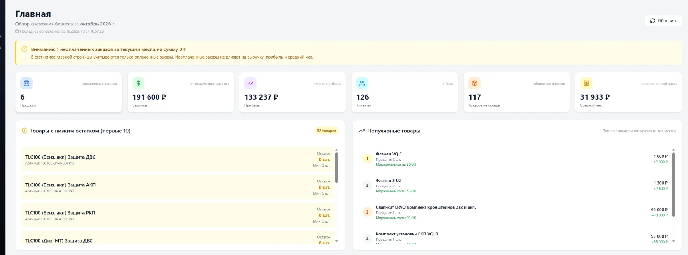
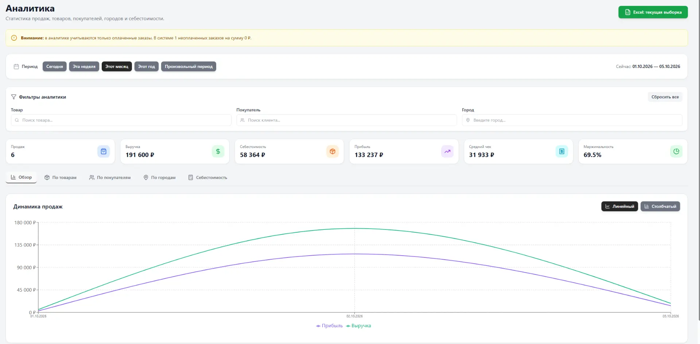
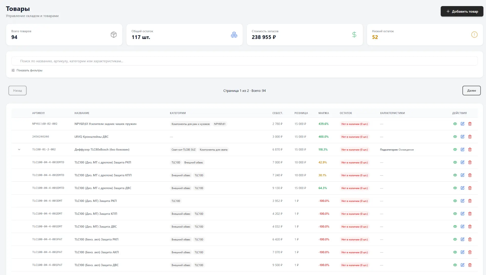
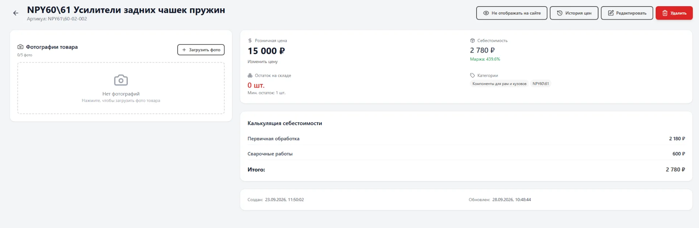
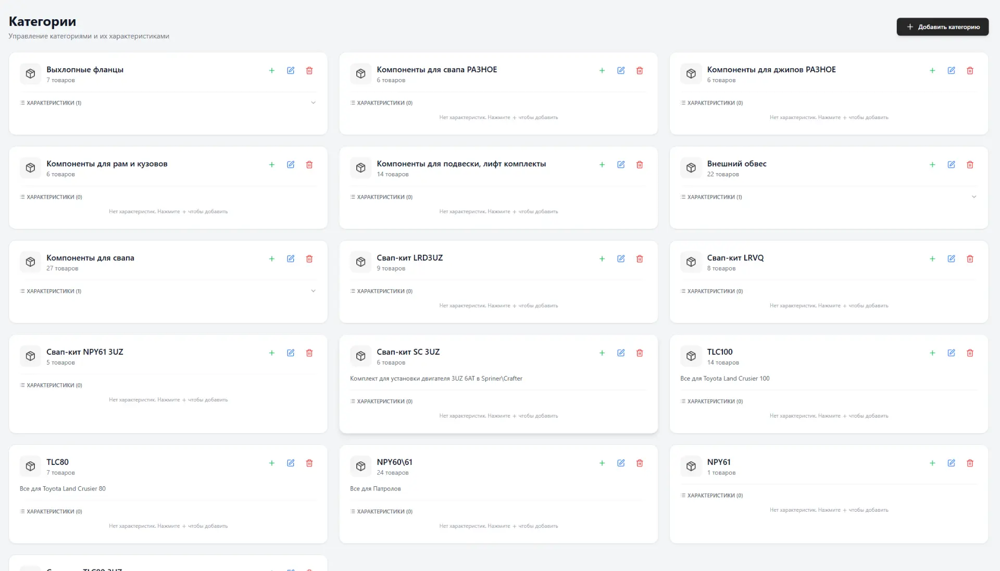
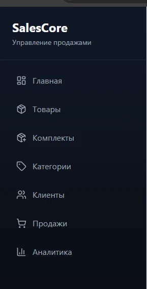
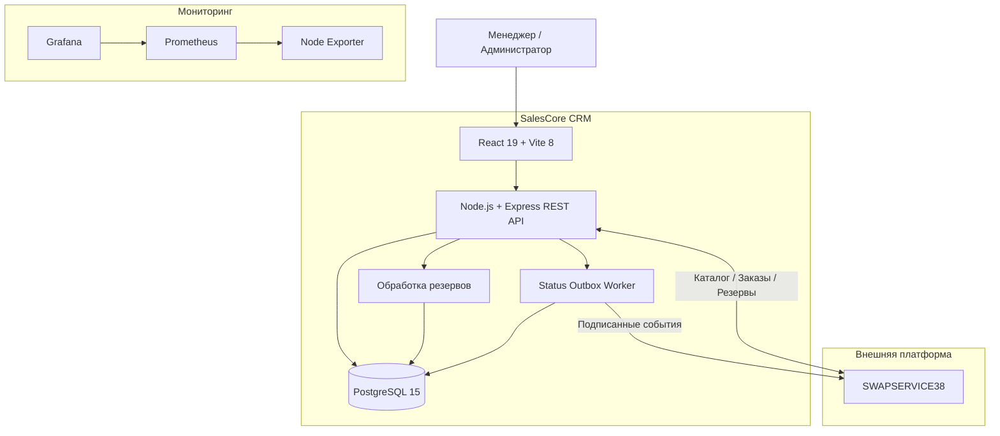
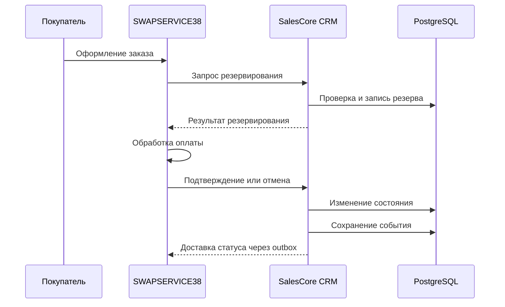

# SalesCore CRM

### Full-stack CRM-платформа для управления продажами, складом и автомобильным бизнесом

[](https://www.typescriptlang.org/)
[](https://react.dev/)
[](https://nodejs.org/)
[](https://www.postgresql.org/)
[](https://www.prisma.io/)
[](https://www.docker.com/)

**[Архитектура](ARCHITECTURE.md)** · **[Резервное копирование](BACKUP_RESTORE.md)** · **[SWAPSERVICE38](https://swap38.ru)** · **[Исходный код](https://github.com/Mikhail1708/crm-tunning)**

---

## О проекте

**SalesCore CRM** — действующая коммерческая CRM-система, разработанная с нуля для автоматизации работы автомобильного сервиса и тюнинг-ателье **SWAPSERVICE38**.

Проект объединяет складской учёт, управление товарами, продажи, клиентскую базу, аналитику, финансовые показатели и интеграцию с отдельным интернет-магазином.

Система создавалась одним разработчиком: от проектирования базы данных и бизнес-логики до интерфейса, API, контейнеризации и серверной инфраструктуры.

> **Статус:** Production — используется в реальном бизнесе.
>
> **Назначение:** внутренняя система управления автомобильным сервисом.
>
> **Архитектура:** React SPA + Express REST API + PostgreSQL.
>
> **Интеграция:** двусторонний обмен данными со SWAPSERVICE38.

В отличие от универсальных CRM, SalesCore учитывает специфику автомобильного бизнеса: собственное производство комплектующих, себестоимость изготовления, складские остатки, товарные комплекты и обработку заказов с внешнего сайта.

## Интерфейс системы

Интерфейс выполнен в минималистичном стиле: светлая рабочая область, тёмная навигация, аналитические карточки, таблицы, фильтры и интерактивные графики.

### Главная панель — Dashboard



Главная страница объединяет ключевые показатели бизнеса: продажи, выручку, чистую прибыль, количество клиентов, складские остатки и средний чек.

Отдельные блоки показывают популярные товары и позиции, требующие пополнения запасов.

### Аналитика и отчётность



Аналитический модуль позволяет оценивать эффективность продаж по выбранному периоду.

Реализованы:

- Выручка, себестоимость и прибыль.
- Средний чек и маржинальность.
- Динамика продаж.
- Анализ товаров и покупателей.
- Фильтрация по городам.
- Произвольные временные интервалы.
- Линейные и столбчатые графики.
- Экспорт отчётов в Excel.

### Управление товарами и складом



Складской модуль объединяет товары, категории, артикулы, цены, себестоимость и остатки.

Система позволяет искать товары по названию, артикулу и характеристикам, контролировать минимальные остатки и отслеживать маржинальность.

### Карточка товара



Карточка товара содержит подробную информацию о продукции.

Поддерживаются фотографии, категории, характеристики, история цен и расчёт себестоимости по отдельным статьям затрат.

Также предусмотрено управление отображением продукции в интернет-магазине.

### Категории и характеристики



Категории используются для структурирования ассортимента и настройки характеристик товаров.

Это позволяет управлять специализированными автомобильными компонентами, включая комплекты для свапов, элементы подвески, защиты и тюнинга.

### Клиентская база


Раздел клиентов предоставляет поиск, сортировку, добавление новых записей и просмотр сводной статистики.

CRM учитывает историю взаимодействий, покупки и связанные с клиентами данные.

### Навигация



Боковая навигация обеспечивает быстрый переход между основными рабочими разделами системы.

*Скриншоты отражают интерфейс рабочей версии CRM. Данные и оформление могут изменяться по мере развития проекта.*

## Основные возможности

### 01. Складской учёт

- Создание, редактирование и удаление товаров.
- Управление артикулами.
- Учёт себестоимости и розничных цен.
- Расчёт маржинальности.
- Контроль складских остатков.
- Уведомления о низком остатке.
- История изменения цен.
- Работа с изображениями.
- Категории и характеристики товаров.

### 02. Комплекты товаров

CRM поддерживает составные товарные комплекты, состоящие из нескольких компонентов.

Для комплектов предусмотрены управление составом, количеством компонентов и связями с основным каталогом.

Этот механизм используется для автомобильных решений, включающих несколько деталей и узлов.

### 03. Продажи и заказы

- Создание заказов.
- Добавление товаров и управление позициями.
- Работа со скидками.
- Учёт оплаты.
- Изменение статусов.
- Отмена заказов.
- Контроль и резервирование остатков.
- Формирование печатных документов.
- Учёт выручки и прибыли.
- Синхронизация с интернет-магазином.

### 04. Клиенты

- Ведение клиентской базы.
- Контактные данные.
- Информация об автомобилях.
- История покупок.
- Индивидуальные скидки.
- Общая сумма покупок.
- Поиск и сортировка клиентов.

### 05. Аналитика

- Финансовые показатели.
- Динамика продаж.
- Статистика по товарам.
- Аналитика покупателей.
- Географическая статистика.
- Учёт себестоимости.
- Маржинальность.
- Экспорт XLSX.

### 06. Администрирование

- Роли `admin` и `manager`.
- Разграничение прав доступа.
- Журнал аудита.
- Административные операции.
- Управление справочниками.
- Резервное копирование.
- Восстановление данных.

## Технологический стек

| Уровень | Технологии |
|---|---|
| Frontend | React 19, TypeScript |
| Сборка | Vite 8 |
| UI | Tailwind CSS, Lucide React |
| Routing | React Router 7 |
| HTTP | Axios |
| Графики | Recharts |
| Экспорт | XLSX |
| Backend | Node.js 20, Express 4 |
| Язык backend | TypeScript |
| ORM | Prisma 5 |
| Database | PostgreSQL 15 |
| Auth | JWT, HttpOnly cookies |
| Validation | Express Validator |
| Security | Helmet, CORS, Rate Limiting |
| Images | Multer, Sharp |
| Infrastructure | Docker, Docker Compose, nginx |
| CI/CD | GitHub Actions |
| Monitoring | Prometheus, Grafana, Node Exporter |
| Integration | REST API, Webhooks |

## Архитектура

SalesCore CRM представляет собой модульный монолит с отдельными frontend и backend.

Frontend отвечает за пользовательский интерфейс, backend — за бизнес-логику, авторизацию, управление данными и интеграции.

PostgreSQL используется для хранения информации о товарах, клиентах, заказах, финансовых операциях, резервировании и событиях синхронизации.



### Основные архитектурные принципы

- Разделение пользовательского интерфейса и серверной логики.
- Централизованная работа с данными через Prisma.
- Транзакционная обработка складских операций.
- Контроль повторных запросов.
- Ролевое разграничение доступа.
- Асинхронная доставка интеграционных событий.
- Отдельные процедуры резервного копирования и восстановления.

**Подробности:** [ARCHITECTURE.md](ARCHITECTURE.md).

## Интеграция со SWAPSERVICE38

CRM взаимодействует с отдельной платформой интернет-магазина:

**[SWAPSERVICE38 Website](https://github.com/Mikhail1708/swapservice38-website)**

Системы решают разные задачи.

| SWAPSERVICE38 | SalesCore CRM |
|---|---|
| Публичный каталог | Управление каталогом |
| Корзина | Складские остатки |
| Оформление заказа | Резервирование товаров |
| Онлайн-оплата | Обработка бизнес-статусов |
| Личный кабинет | Внутренние операции |
| Уведомления покупателям | Учёт продаж |

### Сценарий обработки заказа



Диаграмма отражает общую логику взаимодействия, а не все промежуточные состояния и исключительные сценарии.

### Transactional Outbox

Для синхронизации статусов используется долговременная очередь событий на базе PostgreSQL.

События сохраняются в базе и обрабатываются фоновым процессом.

Механизм предусматривает повторные попытки доставки и сохранение состояния обработки при временной недоступности внешней платформы.

### Резервирование остатков

CRM поддерживает резервирование товаров для внешних заказов.

При обработке учитываются доступность товара, количество, идентификаторы заказов и состояние резерва.

Механизм позволяет координировать складские операции между CRM и интернет-магазином.

## База данных

Основные группы сущностей:

| Область | Модели |
|---|---|
| Пользователи | `User` |
| Каталог | `Product`, `Category`, `ProductCategory` |
| Характеристики | `CategoryField`, `ProductCharacteristic` |
| Комплекты | `ProductKit`, `ProductKitItem` |
| Клиенты | `Client` |
| Продажи | `Sale`, `SaleDocument`, `SaleDocumentItem` |
| Финансы | `Expense`, `InvoiceAllocation` |
| Медиа | `ProductImage` |
| История цен | `PriceHistory` |
| Резервы | `InventoryReservation`, `InventoryReservationItem` |
| Синхронизация | `CrmStatusOutboxEvent` |

Prisma используется для доступа к данным и управления схемой базы.

## Инфраструктура и DevOps

CRM развёрнута как набор сервисов, работающих в Docker-окружении.

### Docker Compose

Основные сервисы:

```text
SalesCore CRM
│
├── Frontend
│   └── React / nginx
│
├── Backend
│   └── Node.js / Express
│
├── Database
│   └── PostgreSQL 15
│
└── Monitoring
    ├── Prometheus
    ├── Grafana
    └── Node Exporter
```

### CI/CD

В репозитории предусмотрен workflow GitHub Actions для автоматизации развёртывания.

Конфигурация использует SSH/SCP для передачи файлов и выполнения команд на сервере.

### Мониторинг

Для наблюдения за инфраструктурой используются:

- **Prometheus** — сбор метрик.
- **Grafana** — визуализация.
- **Node Exporter** — показатели серверных ресурсов.

### Резервное копирование

В проекте предусмотрены механизмы создания и восстановления резервных копий.

Документирован формат прикладных JSON-бэкапов v4, учитывающий связанные бизнес-сущности, складские резервы и события синхронизации.

Восстановление выполняется как отдельная административная процедура, требующая контроля состояния интеграций.

**Подробнее:** [BACKUP_RESTORE.md](BACKUP_RESTORE.md).

## Структура проекта

```text
crm-tunning/
├── .github/
│   └── workflows/
│
├── backend/
│   ├── prisma/
│   ├── src/
│   │   ├── config/
│   │   ├── controllers/
│   │   ├── domain/
│   │   ├── middleware/
│   │   ├── routes/
│   │   ├── services/
│   │   └── server.ts
│   ├── tests/
│   └── package.json
│
├── frontend/
│   ├── src/
│   │   ├── api/
│   │   ├── components/
│   │   ├── pages/
│   │   └── App.tsx
│   └── package.json
│
├── prometheus/
├── scripts/
│
├── docs/
│   └── screenshots/
│       ├── dashboard.webp
│       ├── analytics.webp
│       ├── products.webp
│       ├── product-details.webp
│       ├── categories.webp
│       ├── clients.webp
│       └── navigation.webp
│
├── docker-compose.yml
├── .env.example
├── ARCHITECTURE.md
├── BACKUP_RESTORE.md
└── README.md
```

## Разработка

Frontend и backend имеют независимые зависимости и команды запуска.

### Backend

```bash
cd backend
npm ci
npm run build
npm start
```

### Frontend

```bash
cd frontend
npm ci
npm run dev
```

Для запуска необходимо подготовить PostgreSQL и обязательные переменные окружения.

**Важно:** текущая публичная конфигурация репозитория не является полностью автономным установочным комплектом. Docker Compose ссылается на `backend/Dockerfile`, который отсутствовал при последней проверке. Конфигурация production и внешние интеграции требуют отдельной настройки.

## Тестирование

Backend:

```bash
cd backend
npm test
npm run build
```

Frontend:

```bash
cd frontend
npm run lint
npm run build
```

Наличие тестов не означает полного покрытия всех бизнес-сценариев.

## Безопасность

В системе предусмотрены:

- JWT-аутентификация.
- HttpOnly cookies.
- Роли `admin` и `manager`.
- Разграничение доступа к операциям.
- CORS и HTTP security headers.
- CSRF-проверки для изменяющих запросов.
- Rate limiting.
- Внутренние API-ключи.
- Проверка подписей интеграционных webhook-сообщений.
- Журнал аудита действий.

Пароли, ключи API, JWT-секреты и реальные данные клиентов не предназначены для публикации.

## Документация

| Документ | Назначение |
|---|---|
| [ARCHITECTURE.md](ARCHITECTURE.md) | Архитектура и устройство CRM |
| [BACKUP_RESTORE.md](BACKUP_RESTORE.md) | Резервное копирование и восстановление |

## Статус проекта

**Production — действующая коммерческая система.**

SalesCore CRM используется для управления внутренними процессами SWAPSERVICE38.

Проект развивается совместно с интернет-магазином и производственной инфраструктурой автомобильного бизнеса.

## Автор

**[Mikhail1708](https://github.com/Mikhail1708)**

Full-stack TypeScript Developer / DevOps

- Проектирование архитектуры.
- Разработка frontend и backend.
- REST API и интеграции.
- PostgreSQL и Prisma.
- Реализация складской и финансовой бизнес-логики.
- Docker и серверная инфраструктура.
- CI/CD, мониторинг и резервное копирование.

### Связанные проекты

**[SWAPSERVICE38 Website](https://github.com/Mikhail1708/swapservice38-website)** — интернет-магазин и публичная платформа автомобильного сервиса, интегрированная с SalesCore CRM.

---

<p align="center">
  <strong>SalesCore CRM</strong>

  Business Operations × Software Engineering
</p>
