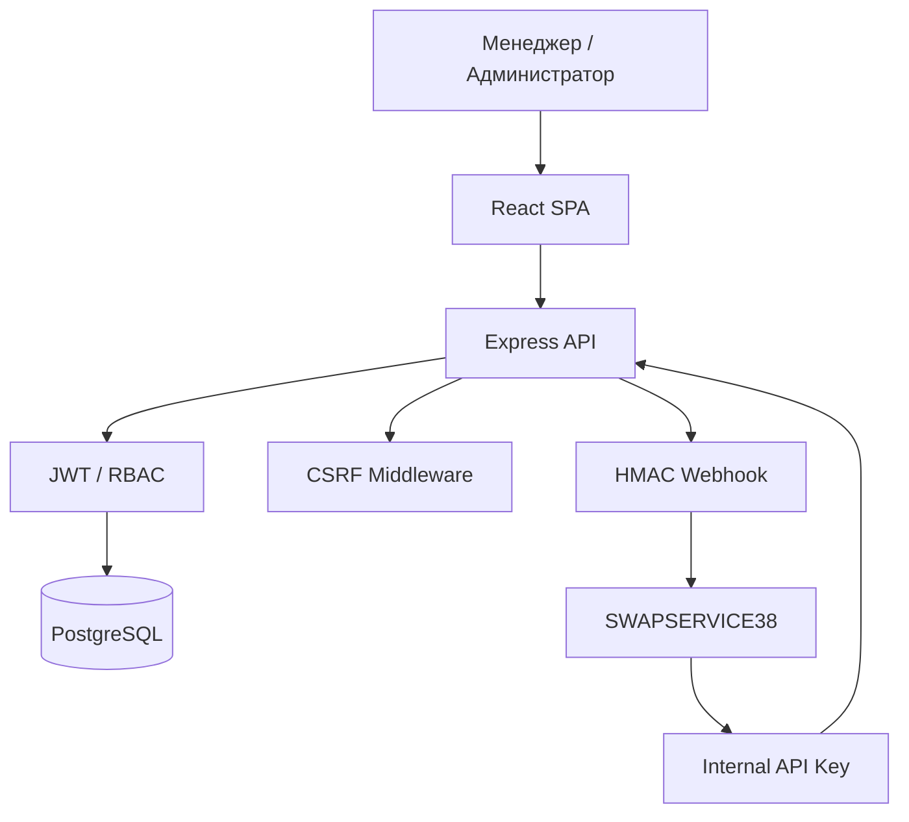

# Политика безопасности SalesCore CRM

> **SalesCore CRM — Security Policy**
>
> Документ описывает механизмы защиты приложения, правила обращения с конфиденциальными данными, ограничения текущей реализации и порядок сообщения об уязвимостях.

## 1. Общие положения

SalesCore CRM — внутренняя система управления продажами, клиентами, товарами, складскими остатками и финансовой аналитикой SWAPSERVICE38.

Приложение обрабатывает коммерческую и персональную информацию. Безопасность системы предполагает защиту следующих компонентов:

- Пользовательские аккаунты и сессии.
- Персональные данные клиентов.
- Финансовые документы и продажи.
- Складские операции.
- PostgreSQL.
- Внутренний REST API.
- Интеграции с интернет-магазином.
- Загружаемые файлы.
- Резервные копии.
- Конфигурационные секреты.

Наличие механизмов защиты в исходном коде не означает, что приложение прошло независимый аудит безопасности.

---

## 2. Архитектура безопасности



Система использует несколько независимых уровней защиты: проверку доступа пользователей, ограничения HTTP-запросов и аутентификацию межсервисного взаимодействия.

## 3. Аутентификация

Для пользовательской авторизации применяется JWT.

В архитектуре предусмотрены:

- Вход пользователя.
- Проверка текущей сессии.
- Выход из аккаунта.
- Проверка JWT на защищённых маршрутах.
- Разграничение прав сотрудников.

В ранее документированной реализации JWT передавался через HttpOnly cookie, а backend также принимал Bearer token.

Актуальные параметры выпуска, проверки и отзыва токенов определяются `auth.routes.ts`, `auth.middleware.ts` и конфигурацией JWT.

### Управление секретами

Секрет подписи JWT должен:

- Храниться вне Git.
- Быть достаточно случайным и длинным.
- Отличаться между production и development.
- Не выводиться в логи.
- Заменяться при подозрении на компрометацию.

Сервер вызывает `getJwtSecret()` при запуске, однако точные правила валидации секрета определяются соответствующим модулем конфигурации.

## 4. Управление доступом

CRM предусматривает две основные роли.

| Роль | Назначение |
|---|---|
| `manager` | Повседневные операции |
| `admin` | Административные действия |

Контроль доступа должен выполняться на backend.

Frontend может скрывать административные страницы и кнопки, но такое скрытие не является достаточной защитой.

Каждый чувствительный endpoint должен отдельно проверять авторизацию и необходимые права.

## 5. CSRF

В `server.ts` реализована собственная CSRF-проверка.

### Получение токена

Endpoint:

`GET /api/csrf-token`

Сервер генерирует случайное 32-байтное значение и устанавливает cookie `csrf-token`.

Параметры cookie:

- `httpOnly: false`.
- `sameSite: lax`.
- `secure: true` в production.
- `path: /`.

### Проверка

В production для большинства изменяющих запросов сервер сравнивает значение cookie с токеном в HTTP-заголовке.

Поддерживаемые заголовки проверки:

- `X-CSRF-Token`.
- `csrf-token`.
- `X-XSRF-Token`.

При несовпадении возвращается HTTP `403`.

### Исключения

В текущей реализации CSRF-проверка не выполняется:

- Для `GET`, `HEAD`, `OPTIONS`, `DELETE`.
- Для путей из списка `PUBLIC_PATHS`.
- В development.

Список исключений включает маршруты входа, публичного API, healthcheck, внешних заказов и интеграционных webhook.

**Ограничение:** метод `DELETE` исключён из CSRF-проверки глобально. Это требует отдельной оценки риска для cookie-аутентифицированных операций.

CSRF-исключение само по себе не отключает JWT, API-key или другие проверки, подключённые непосредственно в маршрутах.

## 6. CORS

Backend использует ограниченный список разрешённых браузерных источников.

### Production

- `https://swapcrm38.ru`
- `https://www.swapcrm38.ru`

### Development

- `http://localhost:5173`
- `http://127.0.0.1:5173`
- `http://localhost:5001`
- `http://127.0.0.1:5001`
- `http://localhost:3001`
- `http://127.0.0.1:3001`

Настройка использует:

`credentials: true`

Разрешены методы:

`GET`, `POST`, `PUT`, `PATCH`, `DELETE`, `OPTIONS`, `HEAD`.

Запросы с неизвестным значением Origin отклоняются CORS middleware.

Запросы без Origin допускаются этой настройкой, поэтому CORS нельзя рассматривать как замену серверной аутентификации.

## 7. Rate Limiting

Для `/api/public` подключён ограничитель:

| Параметр | Значение |
|---|---|
| Окно | 60 секунд |
| Максимум | 500 запросов |
| Стандартные заголовки | Включены |
| Устаревшие заголовки | Отключены |

При превышении лимита сервер возвращает ошибку ограничения запросов.

В проекте также присутствуют отдельные rate-limit middleware.

Их применение к авторизации и другим endpoint необходимо оценивать по конкретным router-файлам.

## 8. Безопасность REST API

Основные группы маршрутов:

- `/api/auth`
- `/api/products`
- `/api/product-kits`
- `/api/categories`
- `/api/sale-documents`
- `/api/clients`
- `/api/audit`
- `/api/reports`
- `/api/dashboard`
- `/api/public`

Для защищённых операций должны применяться:

1. Аутентификация.
2. Проверка роли.
3. Валидация входных данных.
4. Проверка прав на конкретную операцию.
5. Ограничение ресурсов.
6. Безопасная обработка ошибок.

### Ограничение размера запросов

В текущем `server.ts` установлены:

| Формат | Максимальный размер |
|---|---|
| JSON | 100 МБ |
| URL-encoded | 50 МБ |

Эти значения не следует считать оптимальными для всех endpoint.

Для снижения риска чрезмерного потребления памяти рекомендуется использовать более строгие ограничения в соответствии с фактическими потребностями API.

## 9. Защита межсервисной интеграции

CRM интегрирована с интернет-магазином SWAPSERVICE38.

### Внутренний API

Для части внутренних операций предусмотрен `X-API-Key`.

Ключ должен передаваться только между доверенными сервисами и храниться в конфигурации окружения.

### Webhook

Изменения статусов заказов доставляются на:

`https://swap38.ru/api/webhooks/crm/order-status`

Для подтверждения подлинности используется HMAC-SHA256.

Заголовок подписи:

`X-Webhook-Signature`

Конфигурация задаётся через:

- `SITE_WEBHOOK_URL`.
- `WEBHOOK_SECRET`.

При production-запуске вызывается `webhookConfiguration()`.

Согласно документации интеграции, конфигурация проверяет допустимость endpoint и секретов.

### Доставка событий

Для синхронизации статусов применяется PostgreSQL outbox.

При запуске сервера активируется:

`startOrderStatusOutboxDispatcher()`

Это обеспечивает механизм повторной обработки событий при временных сбоях доставки.

Повторная доставка должна обрабатываться получателем идемпотентно.

## 10. Складские операции

Для автоматического завершения просроченных резервов при запуске backend активируется:

`startInventoryReservationExpiryWorker()`

Складские операции требуют особого контроля, поскольку некорректные изменения могут привести к:

- Отрицательным остаткам.
- Повторному списанию.
- Потере резервов.
- Несоответствию CRM и сайта.

Защита таких операций должна обеспечиваться транзакциями, ограничениями БД и проверками конкурентного доступа.

## 11. Загрузка и хранение файлов

CRM предоставляет изображения через:

`/uploads`

В исходной архитектуре использовались Multer и Sharp для обработки изображений.

Файлы должны проходить проверку:

- Размера.
- Типа содержимого.
- Допустимого формата.
- Безопасного имени.
- Права пользователя на изменение товара.

**Важно:** каталог `/uploads` публично доступен через `express.static`. В него нельзя помещать конфиденциальные документы, резервные копии, секреты или приватные файлы.

## 12. Защита PostgreSQL

PostgreSQL является основным хранилищем данных CRM.

Для работы с БД используется Prisma ORM.

Основные требования:

- Использовать отдельные учётные данные приложения.
- Не публиковать `DATABASE_URL`.
- Ограничивать сетевую доступность PostgreSQL.
- Применять миграции контролируемо.
- Проверять изменения схемы.
- Создавать резервные копии.
- Не использовать production-базу для экспериментов.

Транзакции особенно важны для заказов, финансовых операций и резервирования.

## 13. Переменные окружения

К чувствительным параметрам относятся:

- `DATABASE_URL`.
- `POSTGRES_PASSWORD`.
- `JWT_SECRET`.
- `INTERNAL_API_KEY`.
- `WEBHOOK_SECRET`.
- Учётные данные мониторинга.
- Другие токены и ключи интеграций.

Файл `.env` не должен публиковаться в GitHub.

Для демонстрации конфигурации используется `.env.example` с безопасными значениями-заглушками.

### При утечке

Если секрет оказался в публичном репозитории:

1. Считать его потенциально скомпрометированным.
2. Определить все сервисы, где он используется.
3. Подготовить безопасную замену.
4. Выполнить ротацию с учётом влияния на production.
5. Проверить историю Git.
6. Исключить повторную публикацию.

Удаление файла только из последнего коммита не устраняет секрет из предыдущих коммитов.

## 14. Журналирование и аудит

CRM предусматривает аудит отдельных пользовательских операций.

В исходной архитектуре журнал сохранялся в JSON Lines.

При журналировании необходимо исключать:

- Пароли.
- JWT.
- Cookie сессий.
- API-ключи.
- Секреты webhook.
- Полные строки подключения.

Наличие файла `audit.middleware.ts` не подтверждает, что все действия пользователей автоматически регистрируются.

## 15. Резервное копирование

CRM поддерживает прикладные JSON-бэкапы и отдельный серверный скрипт резервирования PostgreSQL.

Резервные копии могут содержать персональные данные и секреты.

Необходимо обеспечивать:

- Контроль доступа.
- Защищённое хранение.
- Проверку целостности.
- Безопасное восстановление.
- Разделение production и тестовых сред.

Подробности описаны в [BACKUP_RESTORE.md](BACKUP_RESTORE.md).

## 16. Зависимости

Проект использует npm-пакеты frontend и backend.

Для контроля безопасности зависимостей рекомендуется выполнять:

```bash
npm audit
```

А также:

- Проверять обновления зависимостей.
- Анализировать критические уязвимости.
- Контролировать изменения lock-файлов.
- Проверять совместимость обновлений.
- Не обновлять production-зависимости без тестирования.

Успешное выполнение `npm audit` само по себе не гарантирует отсутствие уязвимостей приложения.

## 17. Развёртывание

В проекте присутствует GitHub Actions workflow:

`.github/workflows/deploy.yml`

При настройке CI/CD необходимо:

- Использовать GitHub Secrets для чувствительных значений.
- Ограничивать доступ к production.
- Не выводить секреты в логи.
- Проверять права SSH-ключей.
- Контролировать запускающие ветки.
- Не удалять постоянные Docker volumes без необходимости.
- Иметь проверенный план восстановления.

После изменения основной ветки репозитория необходимо отдельно проверить триггеры workflow.

## 18. Известные ограничения

По состоянию представленного `server.ts` подтверждены следующие особенности.

| Область | Состояние |
|---|---|
| JWT | Используется |
| CORS | Настроен |
| CSRF | Подключён с исключениями |
| CSRF для DELETE | Не применяется |
| CSRF в development | Отключён |
| Rate limit `/api/public` | 500 запросов/мин |
| `/uploads` | Публичная статика |
| JSON body limit | 100 МБ |
| URL-encoded limit | 50 МБ |
| Outbox dispatcher | Запускается |
| Reservation expiry worker | Запускается |
| `helmet` | Подключение в показанном `server.ts` отсутствует |
| Общая проверка всех маршрутов | Не проводилась |
| Независимый security audit | Не подтверждён |

Таблица фиксирует наблюдаемое состояние, а не утверждает наличие эксплуатируемых уязвимостей.

## 19. Сообщение об уязвимостях

Если обнаружена потенциальная уязвимость SalesCore CRM, не публикуйте технические детали, реальные токены, персональные данные или готовые способы эксплуатации в открытых GitHub Issues.

Рекомендуемый канал:

**GitHub → Security → Advisories → Report a vulnerability**, если Private Vulnerability Reporting включён владельцем репозитория.

В сообщении желательно указать:

- Затронутый компонент.
- Версию или коммит.
- Условия воспроизведения.
- Потенциальное влияние.
- Безопасное описание проблемы.

Не проводите тестирование на production, которое может повредить данные, нарушить доступность сервиса или затронуть пользователей, без разрешения владельца системы.

## 20. Область ответственности

Данная политика описывает архитектурные механизмы и правила работы с системой.

Документ не является:

- Результатом пентеста.
- Сертификатом соответствия требованиям безопасности.
- Подтверждением отсутствия уязвимостей.
- Гарантией соответствия законодательству.
- Подтверждением корректности всех production-настроек.

Фактическая безопасность зависит от исходного кода, инфраструктуры, конфигурации и эксплуатационных процедур.

---

## Связанные документы

- [README.md](README.md)
- [ARCHITECTURE.md](ARCHITECTURE.md)
- [BACKUP_RESTORE.md](BACKUP_RESTORE.md)
- [SWAPSERVICE38 Website](https://github.com/Mikhail1708/swapservice38-website)

---

**SalesCore CRM**

*Security by Design × Data Integrity × Access Control*

Разработчик: [Mikhail1708](https://github.com/Mikhail1708)
